# GaussPD TD 103 [SR.IR20260521001079.002]

# SR 支持分层记忆实例与会话生命周期 Story设计文档

## 概述

| 日期      | 修改描述                                          | 作者   |
| --------- | ------------------------------------------------- | ------ |
| 2026/7/12 | 基于当前实例与 Runtime 生命周期实现完成初稿       | 邓若辰 |
| 2026/7/13 | 按公开 C API 精读结果重构实现、接口和测试设计     | 邓若辰 |
| 2026/7/15 | 补充太初 Java/JNI 外层用法、JSON 配置和 Open 参数 | 邓若辰 |
| 2026/7/15 | 按太初云请求级微服务真实运行方式调整生命周期主线  | 邓若辰 |
| 2026/7/16 | 重构外层用法、配置映射和四个函数的调用规则        | 邓若辰 |

本文档面向“支持分层记忆实例与会话生命周期”Story，核心生命周期仍限定为
`GsPD_MemoryInit`、`GsPD_MemoryOpen`、`GsPD_MemoryClose`、
`GsPD_MemoryFinalize` 四个公开 C API；同时补充太初集成层实际使用的
`GsPD_MemoryInitJson` 配置适配入口，说明完整配置如何从 Java 传入 JNI，
再转换为 `GsPD_MemoryInstanceConfig` 并进入上述生命周期。

本文所称“分层记忆实例”是一个 C 运行时对象，它在一次运行期间装配 Raw
Conversation、Atom、Scene、Global 等分层记忆能力，不表示为每个记忆层创建
独立 Instance，也不等同于一个独立操作系统进程。

太初云当前采用请求级 run-once 微服务模式：上游调用 Java 的 Add、Search、
Trigger、Dream 等业务接口后，JNI 在**该次外层请求内部**临时创建一个
`GsPD_MemoryInstance`，默认 Open 一个内部 `GsPD_Memory` handle，使用该
handle 或 Instance 完成一次业务计算，将结果写入或读取 IDS 存端，随后立即
Close 和 Finalize。云侧不存在由本模块长期持有、跨请求复用的 Instance；当前
一次临时 Instance 只对应一次外层业务请求和一个内部 handle。

C API 的结构能力比当前 Java 接口更宽：原生调用方仍可长期持有一个 Instance
并在其上 Open 多个 handle。该能力不会删除，但它是通用 C API 的保留能力，
不是太初云当前部署形态。

## 1.1 Story 描述

SR 原始描述：支持分层记忆实例与会话生命周期。

| 序号 | 编号             | AR标题                         | AR描述                                                                                                                                    | 关联的架构元素及影响分析                                                                                                         |
| ---- | ---------------- | ------------------------------ | ----------------------------------------------------------------------------------------------------------------------------------------- | -------------------------------------------------------------------------------------------------------------------------------- |
| 1    | IR20260521001079 | 支持分层记忆实例与会话生命周期 | 为每次太初云业务请求创建边界明确的临时记忆 Instance 和内部 handle，完成业务后及时关闭；同时保留原生 C API 的常驻 Instance、多 handle 能力 | 影响 Java/JNI run-once 适配、公开生命周期 API、Runtime Lifecycle、Instance Core、ServiceRouter、IDS 持久化边界和 Talloc 所有权。 |

本 Story 通过四个公开 C API 建立完整生命周期：

| 阶段             | 公开 API                | 太初云中的输入/输出                     | 当前太初云职责                                                    |
| ---------------- | ----------------------- | --------------------------------------- | ----------------------------------------------------------------- |
| 请求实例创建     | `GsPD_MemoryInit`     | 配置 → 本次请求的 live Instance        | 为一次 Add/Search/Trigger/Dream 等请求装配临时算端运行环境        |
| 内部 handle 打开 | `GsPD_MemoryOpen`     | 临时 Instance + 请求身份 → 单个 handle | 给需要 handle 的 C 业务 API 提供身份、Router 和 Instance 借用入口 |
| 内部 handle 关闭 | `GsPD_MemoryClose`    | 本次请求的 handle → 无                 | 业务完成后立即销毁 Router 和 handle 上下文                        |
| 请求实例销毁     | `GsPD_MemoryFinalize` | 本次请求的 Instance → 无               | 在返回 Java 前释放该请求的全部临时算端资源                        |

需要解决的问题：

| 问题                          | 当前风险                                          | 本 Story 解决方式                                                            |
| ----------------------------- | ------------------------------------------------- | ---------------------------------------------------------------------------- |
| Java 与 C API 边界混淆        | 误以为 Java 每个接口与一个 C API 一一对应         | 明确 Java 是业务门面，JNI 可组合 Init/Open/业务/Close/Finalize 多个 C API    |
| 临时算端资源越过请求边界      | 一次微服务完成后仍残留 Instance、模型或 Router    | JNI run-once 在同一请求内完成完整创建和销毁闭环                              |
| 计算状态与长期数据混淆        | 误以为 Finalize 会让刚写入的记忆消失              | Instance/handle 属于临时算端；长期数据写入 IDS 存端，独立于进程内对象寿命    |
| handle 使用边界不清           | 业务 API 需要 handle，却直接拿 Instance 调用      | JNI 默认 Open 单个 handle，并把它交给 Add/Search/Store 等 handle 级 API      |
| 初始化或业务中途失败          | 留下半初始化实例和已打开资源                      | Init 失败 LIFO 回滚；Open 失败 Finalize；业务完成或失败均 Close 后 Finalize  |
| 通用 C 能力被当前部署形态误删 | 因太初云只用单 handle，误认为多 handle 设计无意义 | 保留常驻 Instance、多 handle 的公开 C API 能力，并明确它不是当前太初部署方式 |

验收目标：

1. 太初 Java 调用传入完整 JSON 内容，不把配置文件路径误传给 JNI。
2. 每次 Add/Search/Trigger/Dream 等外层请求都创建新的临时 Instance。
3. 当前每个临时 Instance 只 Open 一个内部 handle，不跨外层请求复用。
4. handle 级业务 API 使用本次 Open 返回的 handle，不直接把 Instance 当 handle。
5. 写入完成后长期数据保留在 IDS；Close/Finalize 只回收本次算端运行对象。
6. JNI run-once 在业务成功和失败分支都执行 Close/Finalize。
7. 初始化任一阶段失败时，已经打开的资源按逆序完整回滚。
8. Open 失败时不调用 Close，只 Finalize 已成功创建的 Instance。
9. Open 正确解析并复制 `userId/sessionId`，成功创建 ServiceRouter。
10. Finalize 注销 live 状态并释放实例全部共享资源。
11. 原生 C API 仍允许一个 live Instance 创建多个独立 handle。
12. 已 Finalize 的 Instance 再 Open 返回 `GSPD_ERR_INVALID_INPUT`。
13. 文档区分 config 中已生效、部分生效和当前未消费的字段。

## 1.2 需求来源

需求来源为 SR.IR20260521001079.002。主要归档依据如下：

| 类别           | 文件                                                     | 归档用途                                |
| -------------- | -------------------------------------------------------- | --------------------------------------- |
| 公开契约       | `include/gspd_memory_api.h`                            | 双层对象模型、四个公开生命周期函数      |
| 配置与状态     | `include/gspd_memory_types.h`                          | InstanceConfig、OpenOpts、状态码        |
| API 实现       | `src/interface/api_memory.c`                           | 公开 API 到 Runtime 的薄封装            |
| Runtime        | `src/runtime/lifecycle/runtime_lifecycle.c`            | Open/Close、身份初始化、live 校验       |
| Instance 布局  | `src/runtime/instance/include/instance_internal.h`     | 重资源字段和资源注册表                  |
| Handle 布局    | `src/runtime/instance/include/runtime_memory_handle.h` | 轻量 handle 所有权                      |
| Instance Core  | `src/runtime/instance/instance_core.c`                 | Stage 初始化、回滚、live registry、销毁 |
| Router         | `src/service/router/`                                  | 会话级编排器的创建和销毁                |
| 示例           | `sandbox/index.c`、`sandbox/quickstart_common.c`     | 直接 C API 完整调用顺序                 |
| UT             | `tests/ut/instance/`                                   | 参数、回滚、重复 path、销毁后 Open      |
| JSON 配置入口  | `src/interface/api_config.c`                           | 完整 JSON 到 InstanceConfig 的转换      |
| 太初 Java 门面 | `integration/taichu_service/java-src/`                 | 外层 JSON 字符串调用方式                |
| 太初 JNI 适配  | `integration/taichu_service/jni/`                      | Java 字符串转换和 run-once 生命周期     |
| 太初部署配置   | `integration/taichu_service/config/config.json`        | 当前部署配置块及字段形态                |
| Java JSON 说明 | `docs/taichu/13-java-json-interface.html`              | 调用示例和“传内容、不传路径”原则      |

其中 HTML 用于理解外层调用方式；字段名称、是否生效和生命周期顺序以当前
`GsPDMemoryClient.java`、JNI C 源码、`api_config.c` 和实际配置文件为准。

设计假设：

| 假设                                            | 验证状态                                           | 若不成立的影响                     | 应对                                   |
| ----------------------------------------------- | -------------------------------------------------- | ---------------------------------- | -------------------------------------- |
| 太初 Java 接口是业务门面，不与 C API 一一对应   | 已由 Java/JNI 源码验证                             | 生命周期会被错误拆分到 Java 调用方 | 以 JNI run-once 组合链为归档主线       |
| 每个太初业务请求创建一个 Instance 和一个 handle | 已由 Add/Search/Trigger/Dream 等 run-once 源码验证 | 会错误描述为常驻多会话系统         | 用请求级实例图和接口矩阵明确数量关系   |
| 长期记忆状态由 IDS 保存，而非 Instance 内存保存 | 已由当前 Store 配置和写入链路验证                  | 会误判 Finalize 的数据影响         | 区分算端临时对象与存端持久化数据       |
| JNI 在返回 Java 前完成 Close/Finalize           | 已由正常和错误分支验证                             | 请求结束后可能发生资源泄漏         | 为每个 run-once 入口补充生命周期测试   |
| 原生 C API 允许一个 Instance Open 多个 handle   | 已由公开 API 和 Runtime 实现验证                   | 可能误删通用能力或破坏 ABI         | 作为保留能力单独说明，不映射为太初现状 |
| Talloc 父子上下文可以承担 handle 级联释放       | 已由实现采用                                       | 资源归属分散、清理复杂             | handle 私有资源挂到 handleTc           |
| scope 的最终可见性由业务管线继续校验            | 已验证为跨模块行为                                 | 仅凭 handle 身份不足以保证最终隔离 | 本 Story 只规定身份上下文来源          |

## 2 Story设计描述

### 2.1 Story设计（必选）

#### 2.1.1 业界方案分析

本 Story 参考两类成熟 C 生命周期设计。只分析可迁移原则，不引入外部接口。
之所以只选两类，是因为当前核心决策集中在“层级资源所有权”和“显式 handle
关闭”，引入更多产品不会增加有效设计维度。

| 方案                         | 关键机制                                                      | 可迁移原则                              | 本 Story 对应实现                                       | 主要差异                                     |
| ---------------------------- | ------------------------------------------------------------- | --------------------------------------- | ------------------------------------------------------- | -------------------------------------------- |
| Apache Portable Runtime Pool | 父子 pool 和 cleanup，父 pool 销毁时级联回收资源              | 将同生命周期资源挂到统一父上下文        | Instance 根 Talloc、handleTc、资源 destroyer            | 本项目额外维护非内存资源的显式 LIFO 注册表   |
| libuv Handle Lifecycle       | handle 初始化后必须显式 close，关闭完成前不能释放 handle 内存 | handle 的创建、使用、关闭必须有明确顺序 | Open 创建`GsPD_Memory`，Close 销毁 Router 和 handleTc | 当前 Close 同步完成，且没有 closing 状态查询 |

参考资料：

- Apache APR Memory Pool Functions：
  [https://apr.apache.org/docs/apr/trunk/group__apr__pools.html](https://apr.apache.org/docs/apr/trunk/group__apr__pools.html)
- libuv Handle 文档：
  [https://docs.libuv.org/en/latest/handle.html](https://docs.libuv.org/en/latest/handle.html)

设计结论：

```text
太初集成层：一次外层请求 = 一个临时 Instance + 一个内部 handle
C Core：Instance 使用根 Talloc + destroyer，handle 使用独立 handleTc
持久化边界：Instance/handle 属于算端临时资源，长期数据属于 IDS 存端
保留能力：原生 C 调用方仍可让一个常驻 Instance 承载多个 handle
```

方案对比：

| 方案                              | 描述                                                          | 优点                                           | 缺点                                                | 结论                           |
| --------------------------------- | ------------------------------------------------------------- | ---------------------------------------------- | --------------------------------------------------- | ------------------------------ |
| A：请求级 Instance + 单 handle    | 每个 Java 业务请求在 JNI 内完成 Init/Open/业务/Close/Finalize | 符合太初算存分离和微服务边界，请求结束即可回收 | 每次请求承担初始化和销毁成本                        | 当前太初云采用                 |
| B：常驻 Instance + 多 handle      | 服务启动时 Init，多个用户或会话反复 Open/Close                | 重资源复用好，适合进程内会话服务               | 需要常驻进程、handle 管理和严格关闭顺序             | C API 保留能力，太初当前未采用 |
| C：全局单例 + 每个 API 传身份     | 不创建 handle，所有业务 API 直接操作单例                      | 对象数量少                                     | API 重复处理身份，破坏现有 handle 契约              | 不采用                         |
| D：每个业务 API 直接使用 Instance | JNI Init 后不 Open，业务函数全部接收 Instance                 | 生命周期表面更短                               | Add/Search 等现有 C API 需要 handle，需破坏性改签名 | 不采用                         |

#### 2.1.2 实现分析

##### 外层使用规则

太初集成链路分为 Java、JNI 和公开 C API 三层；其中 JNI 再分为导出转换和
run-once 编排两部分：

| 层次            | 对外形态                                                                                    | 生命周期职责                                                    |
| --------------- | ------------------------------------------------------------------------------------------- | --------------------------------------------------------------- |
| Java 层         | `GsPDMemoryClient` 的 Add、Clear、Store、Search、Global、Scene、Trigger、Dream 等业务方法 | 接收`configJson` 和本次请求 JSON，不持有 C Instance 或 handle |
| JNI 导出层      | Java native 方法对应的 JNI 函数                                                             | 完成 Java String/C 字符串和返回值转换                           |
| JNI run-once 层 | JNI 包内部的普通 C 编排函数                                                                 | 把一次 Java 业务调用组合成完整的 C 生命周期                     |
| C API 层        | `GsPD_MemoryInitJson/Open/Close/Finalize` 和具体记忆业务 API                              | 创建、使用并销毁真实的 Instance 和 handle                       |

Java 业务方法与公开 C API 不是一一对应关系。一次 Java 调用会在 JNI 内部
组合多个公开 C API，通用骨架为：

```text
GsPD_MemoryInitJson(configJson, &inst)
  → GsPD_MemoryOpen(inst, &opts, &mem)
  → 一次业务 API
  → GsPD_MemoryClose(mem)
  → GsPD_MemoryFinalize(inst)
```

每次 Java 接口调用都会新建一个临时 Instance，并在该 Instance 上 Open 一个
内部 handle；请求结束后 handle 和 Instance 都被销毁，不跨 Java 请求复用。
`configJson` 可以由 Java 宿主缓存并反复作为只读文本传入，但每次调用仍会
重新解析配置、创建运行资源。长期记忆保存在 IDS，不随 Close/Finalize 删除。

八个业务入口在函数拆分方式以及 `opts.userId/sessionId` 的取值上并不完全
一致，但生命周期边界一致。正常或业务失败时都执行 Close 后 Finalize；
InitJson 失败时没有可清理的 Instance，Open 失败时没有可 Close 的 handle，
JNI 只 Finalize 已经创建成功的 Instance。具体参数、并发和重复调用规则在
下面四个生命周期函数各自的章节中说明。

##### 内部实现总览

从 C Core 的对象所有权看，当前实现采用“Instance + 轻量 handle”的两级模型，
并通过 `ServiceRouter` 将二者连接起来。这里所说的“Instance 共享资源”是指
handle 借用 Instance 内的存储、模型和 Runtime，不表示太初云会跨 Java 请求
共享这个 Instance：

- `GsPD_MemoryInstance` 是进程内的记忆运行资源容器，拥有存储、模型、记忆引擎、
  可选上下文引擎和后台任务等重资源；
- `GsPD_Memory` 是一次 Open 返回的内部句柄，保存本次访问的
  `userId/sessionId`，拥有自己的 Talloc 上下文和 `ServiceRouter`；
- `ServiceRouter` 不重复创建存储或模型，而是把当前句柄的身份和模式绑定到
  Instance 中共享的引擎，供后续写入、检索和上下文组装 API 使用。

四个函数在太初的一次外层请求中构成一个完整闭环：

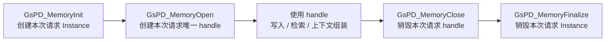

原生 C 调用方可以在 Close 后让仍存活的 Instance 再次 Open，甚至同时维护多个
handle；这是接口的扩展能力。当前太初 JNI 不走这个分支，而是在第一次 Close
后立即 Finalize。

从源码层次看，公开 API 层保持稳定薄封装；Runtime Lifecycle 层负责校验和
会话句柄生命周期；Instance Core 负责共享重资源的分阶段初始化、失败回滚和
最终销毁。

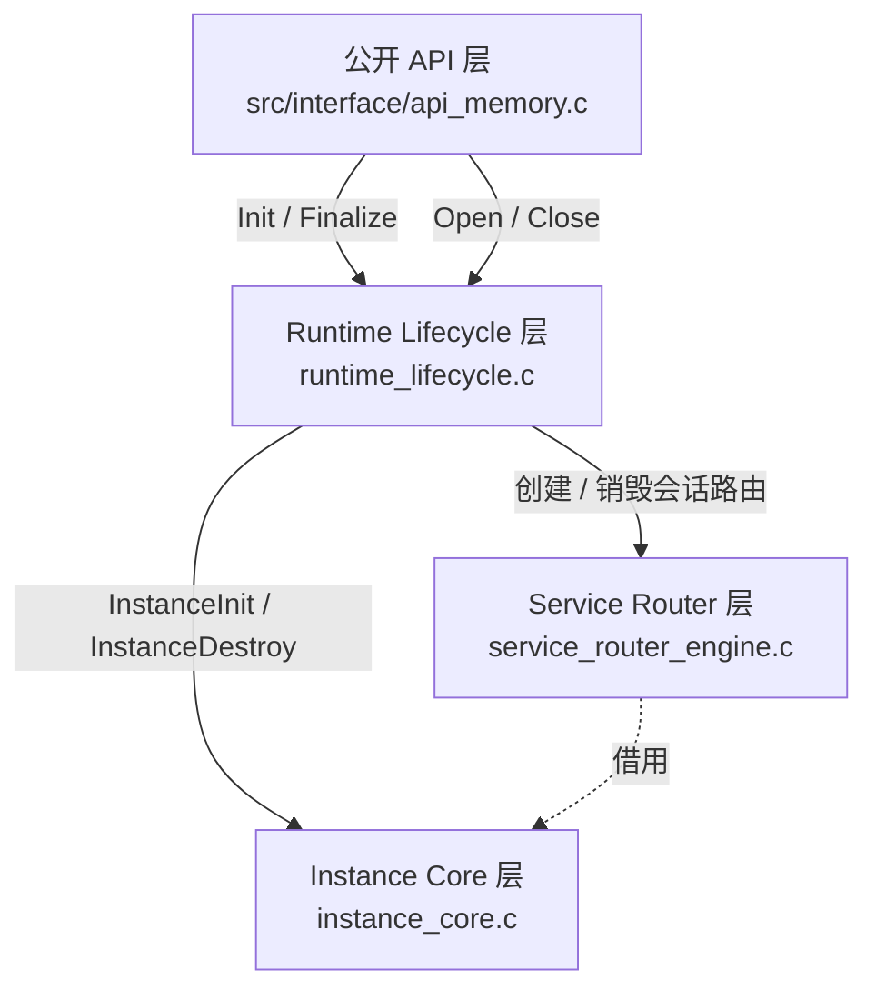

| 层次              | 主要职责                                              | 是否直接拥有重资源 |
| ----------------- | ----------------------------------------------------- | ------------------ |
| 公开 API          | 稳定接口、错误日志、向下转发                          | 否                 |
| Runtime Lifecycle | 参数和 live 状态校验、构造/销毁 handle                | 否                 |
| Instance Core     | 创建和销毁 Store、Adapter、Runtime、Engine、Scheduler | 是                 |
| ServiceRouter     | 绑定会话身份和模式，编排共享引擎                      | 否，依赖均为借用   |

##### C Core 保留能力：常驻 Instance 与多个 handle

前文是太初当前实际采用的 run-once 模式。为了说明“共享 Instance + 多个
handle”这一 C API 能力，再看另一种合法但并非当前太初 Java 使用方式的常驻
模式：假设客户 A、B 在手机上开通记忆功能，手机请求先到业务服务，业务服务
直接集成公开 C API，并在服务存活期间为两位客户保存不同的 handle：

```text
客户 A：userId=user-A，sessionId=chat-A-001
客户 B：userId=user-B，sessionId=chat-B-001
```

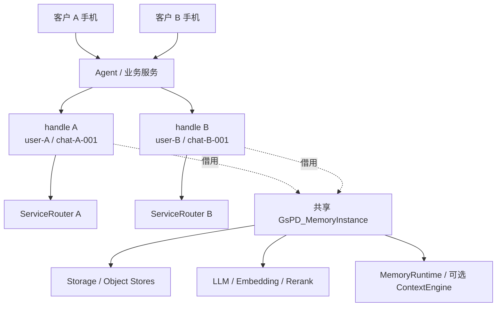

Instance 中的存储、模型和引擎是共享重资源。每次 Open 创建的 handle 保存当前
`userId/sessionId` 和自己的 `ServiceRouter`，但不拥有 Instance。

从服务启动到退出的流程如下：

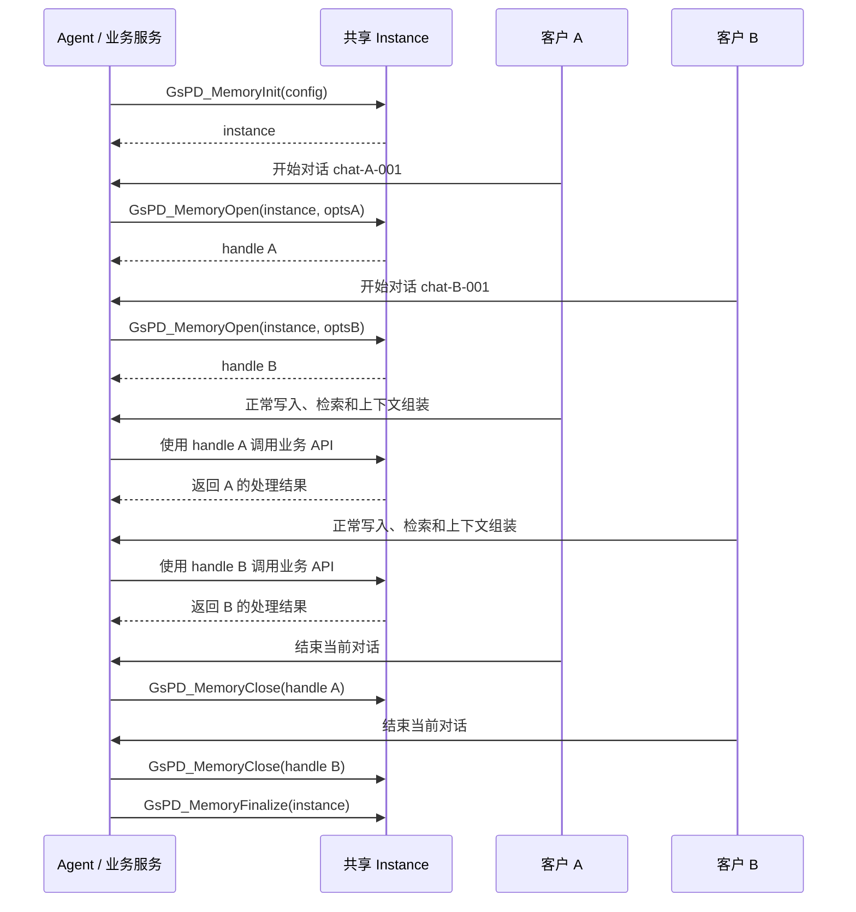

Close 只结束一次会话的运行时 handle，不删除已经持久化的长期记忆；Finalize
才关闭共享存储、模型、引擎和后台资源。

##### 标准合法流程

```C
GsPD_MemoryInstance *inst = NULL;
GsPD_Memory *mem = NULL;

GsPD_Status st = GsPD_MemoryInit(&cfg, &inst);
if (st != GSPD_OK) {
    /* Init 失败：没有可用 Instance，不调用 Finalize */
    return st;
}

st = GsPD_MemoryOpen(inst, &opts, &mem);
if (st != GSPD_OK) {
    /* Open 失败：没有可用 handle，只销毁 Instance */
    GsPD_MemoryFinalize(inst);
    inst = NULL;
    return st;
}

/* 调用一次或多次业务 API */
st = GsPD_MemoryRecordSearch(mem, ...);

/* 无论业务成功还是失败，都执行清理 */
GsPD_MemoryClose(mem);
mem = NULL;

GsPD_MemoryFinalize(inst);
inst = NULL;

return st;
```

##### GsPD_MemoryInitJson

公开接口形态为：

```c
GsPD_Status GsPD_MemoryInitJson(
    const char *configJson,
    GsPD_MemoryInstance **outInst);
```

成功时输出由完整 JSON 配置创建的 live Instance；失败时返回错误、保持
`outInst` 为空，且不留下需要调用方清理的半初始化对象。Instance 成功后必须
最终由 `GsPD_MemoryFinalize` 释放。

太初 Java 的所有业务入口都把完整配置文本传给
`GsPD_MemoryInitJson(configJson, &inst)`。Java 和 JNI 不直接构造
`GsPD_MemoryInstanceConfig`；JSON 到 C 结构体的转换集中在
`src/interface/api_config.c`：

这里的 `configJson` 是配置文件的**完整 JSON 文本**，不是
`config.json` 的文件路径。

```text
完整 configJson
  → InitJsonDefaults(&cfg)             建立 C 默认值
  → ParseConfigJson
     → cJSON_Parse
     → ApplyRoot(root, &cfg)           按固定分组覆盖
  → GsPD_MemoryInit(&cfg, &inst)       创建真实 Instance
  → InstanceAttachConfigContext        配置字符串跟随 Instance 存活
```

`cfg` 本身是局部结构体；URL、路径、模型名和 collection 名等字符串复制到
`cfgTc`。成功后 `cfgTc` 挂到 Instance，并在 Finalize 时释放。因此原始
`configJson` 只需在 `GsPD_MemoryInitJson` 调用期间有效。

配置说明参考 `docs/taichu/11-taichu-service-config.html` 的业务语义；字段
是否真正生效以当前 `api_config.c` 为准，实际输入值以当前
`integration/taichu_service/config/config.json` 为准。说明页中的部分旧字段
和旧当前值不作为本 Story 的实现依据。

###### 默认值和覆盖规则

`InitJsonDefaults` 先清零 `cfg`，再设置 SQLite 默认路径 `gspd_memory.db`、
`pipeline.memoryAdd` 分块、冲突阈值、Scene/Global 缓存、Dream Trigger、
Memory Lineage 和 Rerank 协议等默认值；随后 `ApplyRoot` 按照固定代码顺序
处理配置，与 JSON 文本中的字段排列顺序无关。Memory Lineage 默认开启，
Rerank 协议默认按 OpenAI-compatible 解释；当前部署 JSON 会继续覆盖这些默认值。

###### 基础、身份和路径配置

下列表格中，“写入区域”只描述 JSON 最终落到哪个 C 字段或进程级对象；“含义”
描述该字段之后由哪个运行环节消费，以及它会改变什么行为。

| JSON 分组            | 当前读取字段                                                                                    | 写入区域                                                                                                            | 含义                                                                                                                                                                                                                              | 当前配置结果/未读取项                                                                                                                 |
| -------------------- | ----------------------------------------------------------------------------------------------- | ------------------------------------------------------------------------------------------------------------------- | --------------------------------------------------------------------------------------------------------------------------------------------------------------------------------------------------------------------------------- | ------------------------------------------------------------------------------------------------------------------------------------- |
| `runtime`          | `mode`                                                                                        | `cfg.runtimeMode`                                                                                                 | 决定 Instance 的运行形态。常驻模式可启动 Scheduler/Worker；`stateless_task` 仍创建 Store、模型和 MemoryRuntime，但跳过后台调度线程，生命周期仍由 JNI 显式 Close/Finalize。                                                      | 当前为`stateless_task`；`configPrecedence` 不读取。                                                                               |
| `isolation.keys[]` | `name`、`storeKeyCamel`、`storeKeySnake`、`presence`、`value`、`aliases[]`          | `cfg.isolationKeys[]`；特定默认键还可写入 `cfg.defaultUserId/defaultSessionId`                                  | 定义可供各业务管线选用的动态隔离键，以及这些键在请求 JSON、Store 和别名解析中的字段名。`required` 表示选用该键的管线必须收到请求值；`defaulted` 可注入配置默认值。Open 只使用默认 user/session，不会把动态隔离键写入 handle。 | 当前解析 deviceId、agentId、bioId 共 3 个键，其中 bioId 可回退为`taichu-default-bio`；未配置默认 userId/sessionId。                 |
| `core`             | `vectorDim`、`ioTimeoutMs`、`syncApiTimeoutMs`、`promptsFile`、`promptsCheckInterval` | `cfg.vectorDim`、`cfg.ioTimeoutMs`、`cfg.syncApiTimeoutMs`、`cfg.promptsFile`、`cfg.promptsCheckInterval` | `vectorDim` 约束 Embedding 和向量索引维度；两个 timeout 为运行期 IO/同步调用提供超时基准；Prompt 路径和检查间隔控制 Prompt 文件加载及热检查。                                                                                   | 当前向量维度为 1536，必须与 Embedding 输出和 IDS 向量索引一致；Prompt 检查间隔为 0，表示不启用周期热检查。                            |
| `paths`            | `memoryDir`、`dumpDir`、`userProfilePendingPath`、`userProfilePath`                     | 对应写入`cfg.memoryDir`、`cfg.dumpDir`、`cfg.userProfilePendingPath`、`cfg.userProfilePath`                 | `memoryDir` 是 Scene 历史 Markdown、索引和渐进加载的兼容根目录；`dumpDir` 是显式 Dump 的输出根目录；后两项分别是用户画像事实暂存文件和归纳结果文件。它们是本地辅助路径，不决定 IDS 地址或 collection。                        | 四个字符串复制到`cfgTc` 并跟随 Instance 生命周期；Global/Scene 正式结构化数据仍以 IDS 为主，不能把 `memoryDir` 理解为云侧主存储。 |

`runtime.mode=stateless_task` 只让 Instance 跳过后台 Scheduler，并不会自动
执行 Close/Finalize。一请求一 Instance 仍由 JNI run-once 的显式调用顺序保证。

###### 存储配置

解析器同时保留旧 `storage` 和新的三对象端口。太初当前使用
`memoryStore/stateStore/indexStore`；只要任一对象端口存在，就设置
`cfg.objectStoreEnabled=1` 和 `cfg.objectStoreRequired=1`。

| JSON 分组       | 当前读取字段                                                                                | 写入区域                                                                            | 含义                                                                                                                                                                                                                    | 当前配置结果/未读取项                                                                                                |
| --------------- | ------------------------------------------------------------------------------------------- | ----------------------------------------------------------------------------------- | ----------------------------------------------------------------------------------------------------------------------------------------------------------------------------------------------------------------------- | -------------------------------------------------------------------------------------------------------------------- |
| `storage`     | `type`、`path`，以及旧 IDS 连接、鉴权和增删改查路径                                     | 旧端口`cfg.storage`；其 `path` 还可能成为 `Instance.storagePath`              | 为尚未迁移到三对象端口的调用方保留统一存储配置。在当前 IDS 三端口模式中，它不负责实际业务 IDS 请求，但 fallback path 仍用于 live registry 的同 path 互斥、日志和少量本地兼容路径。                                      | 当前 JSON 没有该分组，因此保留默认`gspd_memory.db`。该文件不会作为 IDS 对象端口打开，却仍参与 Instance path 互斥。 |
| `memoryStore` | `type/mode`、`path`、HTTP/鉴权、keyspace、维度、超时重试、RDB/IDS 子项、`collections` | `cfg.memoryDataStore`                                                             | 主记忆对象端口，保存 Raw/Filtered Conversation、Atom、Candidate、Scene Entry、Global Summary 及扩展记忆对象。IDS 模式下，真正决定远端调用的是 baseUrl、请求路径、鉴权和 collection 映射，`path` 不决定 IDS 请求地址。 | 当前为 IDS；`schema`、`autoMigrate` 不读取。                                                                     |
| `stateStore`  | 与 memoryStore 相同                                                                         | `cfg.stateDataStore`                                                              | 状态对象端口，保存水位、队列、Dream/Procedural 游标、缓存和中间状态。它与长期记忆数据职责分离，但可以配置到同一个 IDS 服务。                                                                                            | 先完整继承 memoryStore，再由 stateStore 覆盖；当前为 IDS 并使用自己的 collection 映射。                              |
| `indexStore`  | 通用 Store 字段，以及`vector`、`keyword` 的地址、鉴权、请求路径、服务类型和 collections | `cfg.indexDataStore`，其中向量和关键词字段分别落到 `vector*`、`keyword*` 成员 | 检索索引端口。向量配置用于文档向量的写入、搜索和删除；keyword 配置用于稀疏/关键词索引。它保存的是检索辅助结构，不替代 memoryStore 中的正式记忆对象。                                                                    | 当前为 IDS；`schema`、`autoMigrate`、`embeddingMode`、`clientEmbedding` 不读取。                             |
|                 |                                                                                             |                                                                                     |                                                                                                                                                                                                                         |                                                                                                                      |
| `vectorStore` | 与`indexStore` 相同                                                                       | 仅在不存在`indexStore` 时写入 `cfg.indexDataStore`                              | 旧配置名称的兼容别名，避免旧调用方立即迁移；一旦同时提供 indexStore，优先使用 indexStore。                                                                                                                              | 当前配置已提供 indexStore，因此不使用该别名。                                                                        |

三端口的继承顺序是：先解析 memoryStore，再复制给 state/index，最后分别用
stateStore 和 indexStore 覆盖。`collections` 会形成“逻辑对象名 → 后端物理
名称”的映射；raw/filtered conversation、Atom 和 Candidate 的特定键还会
填充 IDS 数据类型、向量 service type 或关键词 service type。

新版配置在 `memoryStore.collections` 中增加
`memory_lineage_raw_atom`、`memory_lineage_atom_scene`、
`memory_lineage_atom_global`，在 `stateStore.collections` 中增加
`state_dream_stage_artifact` 和 `state_dream_memory_atom_status`。这些字段只扩展
Instance 初始化时装配的对象映射，不改变 Init/Open/Close/Finalize 的顺序；
是否实际写入血缘数据还受 `memoryLineage.enabled` 控制。

这里有一个与生命周期实例唯一性相关的实现细节：当 memoryStore 是 IDS 时，
`InstanceRuntimeStoragePath` 仍使用旧 `cfg.storage.path` 作为 Instance 的
`storagePath`。当前 JSON 未提供 `storage`，所以取默认 `gspd_memory.db`；该
文件虽然不会作为 IDS 数据端口打开，却会进入 live registry 的同 path 互斥。

IDS 连接常用字段包括 `baseUrl`、`devFakeId`、`accessKey`、`secretKey`、
`idsSign`、`originalCode`、`encryptedCode`、`encryptedType` 以及
`updatePath/queryPath/deletePath`。相应 `*Env` 指定的环境变量存在时优先，
否则才使用 JSON 字符串。

###### 日志和模型配置

| JSON 分组         | 当前读取字段                                                                                                            | 写入区域                                                                                           | 含义                                                                                                                                                                                         | 当前配置结果/未读取项                                                                                                  |
| ----------------- | ----------------------------------------------------------------------------------------------------------------------- | -------------------------------------------------------------------------------------------------- | -------------------------------------------------------------------------------------------------------------------------------------------------------------------------------------------- | ---------------------------------------------------------------------------------------------------------------------- |
| `logSink`       | `type`、`level`、`path`、`maxBytes`、`backupCount`                                                            | 不写入`cfg`；直接修改进程级日志 Sink 和轮转配置                                                  | 控制整个 native 进程的日志目标、最低级别、文件位置、单文件大小和备份数量。它不是 Instance 私有状态，多次 InitJson 使用不同配置时会相互影响；后续 Init 失败也不会自动恢复旧日志配置。         | 当前使用文件日志；`auditPath` 不读取。                                                                               |
| `llm`           | `provider`；`chat` endpoint；`lightChat` endpoint 及开关                                                          | 主模型写入`cfg.llm`；轻量模型写入 `cfg.lightLlm`                                               | 决定 Instance 创建的主生成模型和可选轻量模型，以及 URL、模型名、uid、appId、密钥和健康检查。Chat 用于生成/归纳，LightChat 用于低成本分类等可选任务。                                         | 当前主模型为 Celia，LightChat 关闭；`llm.apiMode`、`authMode`、`extraHeaders` 不读取。                           |
| 顶层`embedding` | `provider`、`baseUrl`、`apiKeySource/apiKeyEnv/apiKey`、`model`、`uid`、`healthCheck.enabled`               | 覆盖或补齐`cfg.llm` 中的 `embedBaseUrl/embedApiKey/embedModel/embedUid/embedHealthCheck`       | 为 Embedding 提供独立配置入口。它在主 LLM provider 已确定时不会随意改变主 provider，但 endpoint、模型、uid 和密钥仍会覆盖嵌套 embedding 值，最终供写入向量和检索查询向量化使用。             | 当前`baseUrl/apiKey/model` 为空，未配置独立 Embedding endpoint；`apiMode`、`authMode`、`extraHeaders` 不读取。 |
| 顶层`rerank`    | `enabled`、`apiMode`、`baseUrl`、`apiKeySource/apiKeyEnv/apiKey`、`model`、`appId`、`healthCheck.enabled` | 写入`cfg.llm.rerankBaseUrl/rerankApiKey/rerankModel/rerankAppId/rerankApiMode/rerankHealthCheck` | 为 Rerank 提供独立于主 LLM provider 的 endpoint 和协议。`apiMode` 可选择 Celia 或 OpenAI/Jina-compatible；`enabled=false` 会清空 endpoint。未提供顶层分组时兼容读取旧的 `llm.rerank`。 | 当前启用 Celia Rerank，配置了独立 endpoint、model 和 appId；健康检查关闭，因此 Init 不发起 Rerank 探测。               |

`llm.provider` 支持 noop、OpenAI-compatible 和 Celia-compatible。模型
`apiKeySource` 的规则是：`inline` 只读 JSON，`env` 只读环境变量，
`auto` 或缺失时先环境变量后 JSON。顶层 embedding 只有在主 LLM 类型仍为
NOOP 时才设置 provider，但其 endpoint/model/uid/key 会继续覆盖嵌套配置。

###### 记忆、检索和场景策略

| JSON 分组                      | 当前读取字段                                                                                              | 写入区域                                                                                                                     | 含义                                                                                                                                                                           | 当前配置结果/未读取项                                                                             |
| ------------------------------ | --------------------------------------------------------------------------------------------------------- | ---------------------------------------------------------------------------------------------------------------------------- | ------------------------------------------------------------------------------------------------------------------------------------------------------------------------------ | ------------------------------------------------------------------------------------------------- |
| `ingestPolicy`               | `conflictThreshold`、`destructiveThreshold`、`confidenceMin`、`stableRetentionMs`                 | `cfg.conflictThreshold`、`cfg.destructiveThreshold`、`cfg.confidenceMin`、`cfg.stableRetentionMs`                    | 控制新事实进入长期记忆时的冲突判定、破坏性变更门槛、最低可信度，以及软删除记录保留多久。它影响写入裁决，不负责请求身份或 IDS 连接。                                            | 当前四项均读取。                                                                                  |
| `pipeline.memoryAdd.chunk`   | `enabled`、`sizeBytes`、`overlapRate`                                                               | `cfg.pipeline.memoryAdd.chunkEnabled/chunkSizeBytes/chunkOverlapRate`                                                      | 控制 Add 对 Filtered Conversation 是否按字节切块、每块目标大小以及相邻块重叠比例。它影响送入抽取/索引管线的文本边界，过小会增加块数，过大会增加单次模型和存储负担。            | 新结构不再读取旧的顶层`memoryAdd`；旧 JSON 即使 Init 成功，也会退回默认分块值。                 |
| `pipeline.<业务>.isolations` | 各业务对象下的`isolations[]`                                                                            | 分别写入`cfg.pipeline.memoryAdd/memoryStore/memoryRecordSearch/memoryGlobalLoad/memorySceneLoad/memoryClear/memoryTrigger` | 为每条业务管线登记其需要解析、校验和透传的动态隔离键。数组成员必须能在`isolation.keys[]` 中找到，且同一管线内不得重复；非法配置使 InitJson 返回 `GSPD_ERR_INVALID_INPUT`。 | 当前 Add/Store/Search/Global/Scene/Trigger 使用 deviceId、agentId、bioId；Clear 只使用 deviceId。 |
| `retrievalPolicy`            | `globalRecallMultiplier`、`rrfK`、`scorePropAlpha`                                                  | 对应写入`cfg.globalRecallMultiplier`、`cfg.rrfK`、`cfg.scorePropAlpha`                                                 | 分别控制 Global 候选扩大倍率、RRF 多路召回融合的平滑常数，以及分层检索中上层分数向下传播的权重。它们改变候选数量和排序分数，不改变 IDS 查询地址。                              | `defaultTopK`、`rerankPolicy` 不读取。                                                        |
| `gcPolicy`                   | `aggCheckInterval`、`gcCheckInterval`、`gcDecayThreshold`、`gcCompressMinCount`、`gcIntervalMs` | 写入`cfg` 同名 GC/聚合字段                                                                                                 | 控制多少次写入后检查聚合和 GC、记忆衰减到什么阈值可回收、至少积累多少候选才压缩，以及时间型 GC 的运行间隔。当前是否实际按周期触发还受 Scheduler 是否启动影响。                 | 当前字段均读取；`stateless_task` 下后台周期任务不启动。                                         |
| `sceneGlobalPolicy`          | `triggerThreshold`、`batchSize`、`sceneTopK`、`globalTopK`                                        | `cfg.sceneGlobalTriggerThreshold`、`cfg.sceneGlobalBatchSize`、`cfg.sceneAtomCacheTopK`、`cfg.globalAtomCacheTopK`   | 控制积累多少数据后触发 Scene/Global 聚合、每批处理多少条，以及 Scene/Global Atom Cache 保留多少候选。它决定聚合节奏与缓存容量。                                                | 当前四项均读取。                                                                                  |
| `scenePolicy`                | 分配/聚类阈值、pending 数量与 TTL、Scene 容量、休眠时间和 Pass 行为字段                                   | `cfg.scene` 中除 catalog 外的策略成员                                                                                      | 控制 Atom 如何分配到已有 Scene、何时创建动态 Scene、pending 数据何时聚类或过期、最多维护多少动态 Scene，以及 Pass 阶段是否携带 Scene 信息。                                    | 当前列出的策略字段均读取。                                                                        |
| `sceneCatalog`               | `presetScenes[].sceneTag/displayName/definition/subScenes`                                              | 动态构造`cfg.scene.sceneCatalog` 及其 preset 数组                                                                          | 定义系统已知的预设场景、展示名、语义定义和子场景。解析阶段校验必填字符串与 sceneTag 唯一性；业务管线用它稳定场景标签并为 Scene/Global 内容提供分类语义。                       | 当前构造 20 个预设 Scene；`version` 不读取。                                                    |

新版管线配置的输入形态如下：

```json
{
  "pipeline": {
    "memoryAdd": {
      "chunk": {
        "enabled": true,
        "sizeBytes": 300,
        "overlapRate": 0.1
      },
      "isolations": ["deviceId", "agentId", "bioId"]
    },
    "memoryRecordSearch": {
      "isolations": ["deviceId", "agentId", "bioId"]
    },
    "memoryClear": {
      "isolations": ["deviceId"]
    }
  }
}
```

这里的 `isolation.keys[]` 是可用隔离键字典，
`pipeline.<业务>.isolations[]` 是具体业务选择的键集合。仅在字典中声明键，
不会让所有业务管线自动使用该键。

若 `pipeline` 不是对象、某条业务配置不是对象、`isolations` 不是字符串数组，
或数组包含未声明、重复、空白、超出数量上限的键，`ParseConfigJson` 直接返回
`GSPD_ERR_INVALID_INPUT`。失败发生在 `GsPD_MemoryInit` 之前，`cfgTc` 会被销毁，
`outInst` 保持为空，调用方不需要执行 Finalize。

当前配置形成 20 个预设 Scene。`sceneCatalog` 若存在但不是对象、
`presetScenes` 不是数组、必填字符串为空或 sceneTag 重复，会使 InitJson
直接失败。

###### 调度和功能配置

| JSON 分组            | 当前读取字段                                                                 | 写入区域                                                                                                              | 含义                                                                                                                                                                   | 当前配置结果/未读取项                                                                                                                 |
| -------------------- | ---------------------------------------------------------------------------- | --------------------------------------------------------------------------------------------------------------------- | ---------------------------------------------------------------------------------------------------------------------------------------------------------------------- | ------------------------------------------------------------------------------------------------------------------------------------- |
| `scheduler`        | `preset`，以及 Ingest、聚合、长任务、失败清理、Chunk 和 Flush 的精确字段名 | `cfg.schedulingPreset`；动态分配并填充 `cfg.scheduling`                                                           | 为常驻 Instance 定义后台任务的检查周期、触发阈值、批量、重试、清理保留期和 Flush 上限。字段成功解析不代表线程一定启动；是否启动由 runtime mode 决定。                  | 当前 preset 为 cloud，但`stateless_task` 最终不启动 Scheduler；三个字段名与解析器不匹配，见表后说明。                               |
| `proceduralMemory` | `enabled`、`proceduralDir`；debug、prefilter、promotion 的部分布尔字段   | 启用时将目录写入`cfg.proceduralDir`；部分布尔值写入进程环境变量                                                     | `proceduralDir` 指定程序记忆/技能文件的本地目录；debug、预过滤和晋升开关影响程序记忆管线。环境变量是进程级状态，不随单个 Instance 隔离，并且已有环境变量不会被覆盖。 | 当前 enabled 为 true；`candidatePool` 不读取，`learnDebugLog` 只有其 `enabled` 被消费。                                         |
| `dreaming`         | 平铺的`enabled`、`shadowOnly`、`triggerEnabled`、`triggerGateCheck`  | `cfg.dreamingEnabled`、`cfg.dreamingShadowOnly`、`cfg.dreamingTriggerEnabled`、`cfg.dreamingTriggerGateCheck` | 分别控制 Dream 总开关、仅影子运行、是否允许 Trigger 入口，以及 Trigger 前是否检查水位门槛。这里只决定 Instance 能力开关，不等同于一次 Dream run 的任务参数。           | 当前 enabled/shadowOnly 生效；cron、budget、llm、artifact、observability 等嵌套配置不进入`cfg`，Dream JNI 另行解析其中部分参数。    |
| `memoryLineage`    | `enabled`                                                                  | `cfg.memoryLineageEnabled`                                                                                          | 控制后续写入和聚合是否维护 Raw→Atom、Atom→Scene、Atom→Global 的记忆血缘关系。未配置时 InitJson 默认开启；这是 Instance 能力配置，不改变四个生命周期函数的调用顺序。 | 当前显式配置为 false；新增的 lineage collection 映射仍会进入 Store 配置，但本次 Instance 不执行后续血缘维护。                         |
| `userProfile`      | `mergeThreshold`                                                           | `cfg.userProfileMergeThreshold`                                                                                     | 控制 pending 用户画像事实累计到多少条后触发归纳；输入和输出文件位置来自`paths`。                                                                                     | 当前`enabled` 不读取，因此不能用它判断 C Core 是否启停画像逻辑。                                                                    |
| `context`          | `enabled`、`turnWindowSize`、`turnWindowOverlap`、`summaryMaxTokens` | `enabled` 反向写入 `cfg.contextDisabled`；其余写入同名 Context 参数                                               | 控制是否创建 ContextEngine，以及对话窗口保留多少轮、窗口间重叠多少轮、摘要注入最多使用多少 token。它影响会话上下文组装，不影响长期记忆 Store 的创建。                  | 当前 enabled=false，ContextEngine 不创建；后三项虽已存入 cfg，但当前不会被 ContextEngine 消费，MemoryRuntime 和 handle 仍可正常创建。 |

Scheduler 只识别源码中的精确名称：`consolidateSceneIntervalMs`、
`rebuildGlobalIntervalMs`、`chunkIntervalMs`。当前 JSON 中对应的三个不同名称
不会覆盖 preset/默认配置；并且 stateless_task 模式最终不会启动后台
Scheduler。

###### 不进入 `cfg` 的顶层分组

| JSON 分组         | 写入区域 | 含义                                                                                             | 当前行为                                                               |
| ----------------- | -------- | ------------------------------------------------------------------------------------------------ | ---------------------------------------------------------------------- |
| `configVersion` | 无       | 预期用于标记配置格式版本，但当前解析器没有版本分派或兼容性校验。                                 | 不进入`cfg`，修改后不改变 C Core 行为。                              |
| `observability` | 无       | 配置文件希望描述 trace、metrics 等观测策略，但当前 InitJson 没有把它转换为 Instance 观测配置。   | 不进入`cfg`；实际观测由其他运行路径或进程级设施提供。                |
| `secrets`       | 无       | 这是对配置文件密钥策略的声明，不是密钥本身；若要执行“禁止明文”等规则，需要外层加载器显式校验。 | Core 不执行`allowPlaintextInFile` 等声明，不能把它当成已有安全门禁。 |

最终原则是：JSON 中存在字段不代表已经生效。只有被 `ApplyRoot` 下某个
`Apply*` 函数读取并写入 `cfg`，或被明确说明为进程级副作用的字段，才属于
当前实现。

结合当前的 config.json，`cfg` 配置可以概括为：

```
cfg
├─ runtimeMode = STATELESS_TASK
├─ isolationKeys = 3（deviceId / agentId / bioId）
├─ pipeline = 已按七条业务管线登记 isolations
├─ pipeline.memoryAdd.chunk = 已配置
├─ defaultUserId = NULL
├─ defaultSessionId = NULL
├─ vectorDim = 1536
├─ objectStoreEnabled = 1
├─ objectStoreRequired = 1
├─ memoryDataStore = IDS
├─ stateDataStore = IDS
├─ indexDataStore = IDS + vector + keyword
├─ llm.type = CELIA
├─ chat endpoint = 已配置
├─ embedding endpoint = 未配置
├─ rerank = CELIA，已启用，启动健康检查关闭
├─ lightLlm = 未启用
├─ contextDisabled = 1
├─ dreamingEnabled = ON
├─ dreamingShadowOnly = 1
├─ memoryLineageEnabled = OFF
├─ schedulingPreset = CLOUD
├─ scheduling = 已分配，但 stateless_task 不启动 Scheduler
├─ sceneCatalog = 20 个预设场景
├─ proceduralDir = 已配置
└─ paths / policy / scene / GC 等字段按 JSON 覆盖
```

###### 失败与重试

`GsPD_MemoryInitJson` 自身在 JSON 解析和 `cfg` 构造阶段主要返回：

| 返回值                            | 典型情况                                                                  | 重试要求                                      |
| --------------------------------- | ------------------------------------------------------------------------- | --------------------------------------------- |
| `GSPD_ERR_INVALID_INPUT(-1)`    | JSON 为空、无法解析、根节点不是对象，或 isolation/pipeline/Scene 配置非法 | 修正 JSON 结构或字段后重试                    |
| `GSPD_ERR_OOM(-4)`              | 配置 Talloc 上下文、字符串、数组或调度配置分配失败                        | 释放资源或恢复内存后重试                      |
| `GSPD_ERR_CONFIG_CONFLICT(-10)` | `runtime.mode` 或旧 `storage.type` 等枚举值、类型或配置组合冲突       | 修改 JSON；此时尚未进入真实 Instance 创建阶段 |

如果 JSON 已成功形成 `cfg`，随后调用的 `GsPD_MemoryInit` 仍可能返回存储、
Schema、能力未启用或 Instance 已存活等错误；这些状态由 InitJson 原值返回。
失败时 `outInst` 保持为空，不调用 Finalize。

##### GsPD_MemoryInit

`GsPD_MemoryInit` 把一份已经形成的 `GsPD_MemoryInstanceConfig` 转换为完整
可用、登记为 live 的 `GsPD_MemoryInstance`。太初 JNI 不直接调用它，而是由
`GsPD_MemoryInitJson` 在完成默认值和 JSON 覆盖后调用；原生 C 调用方也可以
绕过 JSON，直接传入结构体。

###### 外层用法、并发与重复规则

**1）前一次已经 Finalize。**

```text
Init A → Finalize A → Init B
```

A、B 可以使用相同配置和相同 storage path，因为 A 已经从 live registry 注销。

**2）前一个 Instance 仍然 live，使用相同 storage path。**

```text
Init A(path=X) → 成功
Init B(path=X) → GSPD_ERR_INSTANCE_ALREADY_LIVE
```

同一非空且非 `:memory:` 的最终 storage path 最多登记一个 live Instance。
path 检查发生在 Init 后段，因此 B 可能已经初始化部分模型和 Store，最终才
因 registry 冲突失败并回滚。

若 A、B 使用相同 path 并发 Init，前面的初始化 Stage 可以并发，但 live
registry 的检查与写入由同一把 mutex 保护：

```text
Init A / Init B 并发执行初始化 Stage
→ 竞争 live registry mutex
→ 先获锁者登记成功
→ 后获锁者发现相同 path，注册失败
→ 返回 GSPD_ERR_INSTANCE_ALREADY_LIVE 并 rollback
```

因此 A、B 谁成功不确定，但最终最多只有一个成为 live。严格来说，后进入
登记临界区的 Instance 并未完成注册，而是在冲突检查时直接失败并回滚。

**3）前一个 Instance 仍然 live，使用不同 storage path。**

```text
Init A(path=X) → 成功
Init B(path=Y) → 可以登记为另一个 live Instance
```

若 A、B 并发 Init，registry mutex 仍会让两次登记依次执行；由于 path 不同，
在没有容量或其他初始化错误时两者都会登记成功，不会因 path 冲突回滚。

不同 path 只表示两个 Instance 可以共存，不代表并发 Init 已获得线程安全承诺。
InitJson 还会修改进程级日志、环境配置和调试目录，因此当前安全用法仍是由
宿主串行调用 Init/InitJson。当前太初 IDS 配置的 fallback path 均为
`gspd_memory.db`，同一 native 进程内的 run-once 生命周期更应串行。

**4）Init** 失败与重试。

Init 失败时没有可用 Instance，内部已回滚，不再调用 Finalize。重新执行完整
生命周期是合法的，但应先根据状态码消除失败原因；对配置冲突、能力未启用或
Schema 不兼容进行原样重试没有意义。具体业务是否幂等不由生命周期接口保证。

当前状态码定义以 `include/gspd_memory_types.h` 为准。Instance 各初始化阶段
通常保留底层 Adapter、Store、Schema 或 Runtime 返回的负值，不统一映射成
`GSPD_ERR_INIT_FAILED`。主要失败状态如下：

| 返回值                                  | 典型情况                                                                                                     | 重试要求                                             |
| --------------------------------------- | ------------------------------------------------------------------------------------------------------------ | ---------------------------------------------------- |
| `GSPD_ERR_INVALID_INPUT(-1)`          | `config/outInst` 为空，必要 path/IDS 字段缺失，主 LLM、Store、MemoryRuntime 或 ContextEngine 的输入非法    | 先修正调用参数或配置；原样重试通常仍失败             |
| `GSPD_ERR_INIT_FAILED(-2)`            | 下层组件明确报告内部初始化未完成；当前 Instance Core 不会把所有 stage 失败统一改写成该值                     | 结合 stage 日志定位具体组件后再重试                  |
| `GSPD_ERR_STORAGE_FAULT(-3)`          | Storage、Schema、Meta 或独立 State Storage 打开、建表、attach 或初始化失败                                   | 修复路径、权限、数据库或存储服务后可重试             |
| `GSPD_ERR_OOM(-4)`                    | 根 Talloc、Instance、子上下文、Adapter、Store、MemoryRuntime 或 ContextEngine 分配失败                       | 释放资源或恢复内存后可重新执行完整 Init              |
| `GSPD_ERR_CAPACITY_FULL(-16)`         | live registry 的 4096 个槽位均已占用                                                                         | Finalize 不再使用的 Instance 后重试                  |
| `GSPD_ERR_FEATURE_DISABLED(-17)`      | 配置请求了当前构建未启用或尚不支持的 Store/Adapter 能力                                                      | 更换受支持配置或启用相应构建能力后重试               |
| Schema 类错误`(-19~-23)`              | Schema 描述版本、版本过旧、兼容性、字段或名称校验失败                                                        | 按具体状态完成迁移、修正 Schema 或调整兼容策略后重试 |
| `GSPD_ERR_INSTANCE_ALREADY_LIVE(-26)` | 同一进程已经登记了相同非空、非`:memory:` 存储身份的 live Instance；这是当前新增的独立错误，不再返回 `-1` | 先 Finalize 原 Instance，或改用不同存储身份后重试    |

调用方应在调用前令 `inst = NULL`，仅在返回 `GSPD_OK` 后使用并最终
Finalize。

公开接口形态为：

```c
GsPD_Status GsPD_MemoryInit(
    const GsPD_MemoryInstanceConfig *config,
    GsPD_MemoryInstance **outInst);
```

成功时输出 live Instance；失败时返回错误且不留下需要调用方清理的半初始化
对象。Instance 成功后必须最终由 `GsPD_MemoryFinalize` 释放。

###### 内部调用链

```text
GsPD_MemoryInit
└─ RuntimeMemoryInit
   ├─ 校验 config / outInst
   └─ InstanceInit
      └─ InstanceInitCommon
         ├─ InstanceNormalizeConfig
         ├─ InstanceValidateInitArgs
         ├─ 依次执行 kInitStages
         │  └─ 每阶段成功后登记 destroyer
         └─ InstanceLiveRegister
```

###### 公开 API 层

公开函数不自行创建资源，只负责调用 Runtime 层并记录失败阶段：

```c
GsPD_Status GsPD_MemoryInit(
    const GsPD_MemoryInstanceConfig *config,
    GsPD_MemoryInstance **outInst)
{
    GsPD_Status st = RuntimeMemoryInit(config, outInst);
    if (st != GSPD_OK) {
        return LogMemoryInstanceFailure(
            "GsPD_MemoryInit", config, st, "runtime-init");
    }
    return GSPD_OK;
}
```

###### Runtime 层

Runtime 层负责最外层输入校验、错误日志，然后将生产配置交给 Instance Core。
省略日志包装后的核心路径如下：

```c
GsPD_Status RuntimeMemoryInit(
    const GsPD_MemoryInstanceConfig *config,
    GsPD_MemoryInstance **outInst)
{
    if (config == NULL || outInst == NULL) {
        return GSPD_ERR_INVALID_INPUT;
    }

    GsPD_Status st = InstanceInit(config, outInst);
    if (st != GSPD_OK) {
        ...
    }
    return GSPD_OK;
}
```

这里还没有创建 handle，返回的是 live Instance。太初 JNI 随后只调用一次
`GsPD_MemoryOpen`；原生 C 调用方可以按需调用一次或多次。

###### Instance Core 分阶段初始化

`InstanceInit` 进入 `InstanceInitCommon` 后，以 `kInitStages` 为唯一的初始化
顺序表。当前主要阶段按源码顺序如下：

| 顺序 | Stage                                  | 主要结果                                      |
| ---- | -------------------------------------- | --------------------------------------------- |
| 1    | `alloc`                              | 创建根 Talloc 上下文和 Instance 对象          |
| 2    | `tokenStatsMutex`                    | 初始化 Token 统计和对应互斥量                 |
| 3    | `buildVTables`                       | 装配存储和模型适配器 VTable                   |
| 4    | `openLlm`、`probeAndWrapLlm`       | 打开并探测主 LLM 适配器                       |
| 5    | `openStorage`、`schema`            | 打开存储并初始化 Schema                       |
| 6    | `objectStores`、`openStateStorage` | 创建对象存储和状态存储                        |
| 7    | `openLightLlm`                       | 打开轻量 LLM                                  |
| 8    | `metaAndMutex`、`globalSummary`    | 初始化元数据、互斥量和全局摘要能力            |
| 9    | `memoryRuntime`                      | 创建长期记忆 Runtime                          |
| 10   | `contextEngine`                      | 启用 Context 时创建共享上下文引擎；禁用时跳过 |
| 11   | `prompt`、`persistAndDream`        | 初始化提示词、持久化和后台整理能力            |
| 12   | `scheduler`                          | 启动调度器                                    |


核心循环的含义是：执行一个阶段；成功后立即把对应清理函数登记到资源注册表；
任何阶段失败都跳转到统一回滚出口。

```c
for (size_t i = 0; i < INSTANCE_INIT_STAGE_COUNT; ++i) {
    const struct InitStageEntry *e = &kInitStages[i];
    st = e->fn(&c);
    if (st != GSPD_OK) {
        goto rollback;
    }
    if (e->destroyer != NULL && c.p != NULL) {
        (void)InstanceRegister(&c.p->registry, e->destroyer, c.p);
    }
}
```

以上代码为便于阅读保留了核心控制逻辑；实际源码还包含阶段日志和错误上下文。

###### rollback 初始化失败

初始化失败不会把“半成品 Instance”交给调用方。已经登记的 destroyer 按 LIFO
逆序执行，随后销毁根 Talloc 上下文并返回原始错误码：

```c
rollback:
    if (c.p != NULL) {
        InstanceRollback(&c.p->registry);
    }
    if (c.rootTc != NULL) {
        TallocDestroy(c.rootTc);
    }
    return st;
```

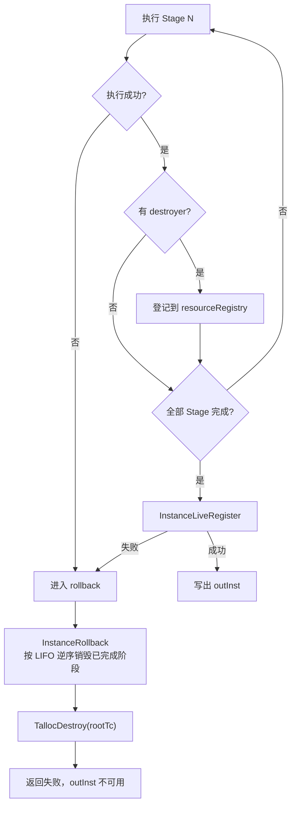

这一设计保证例如“Storage 已打开、已启用的 ContextEngine 创建失败”时，
Storage、模型和此前创建的对象仍会被统一关闭，不需要每个失败分支手写一套
清理逻辑。

###### live 登记与重复实例约束

所有 Stage 成功后，Instance 才进入 live registry。该登记至少承担两项职责：

- 后续 Open 可在解引用 Instance 前通过 `InstanceIsLive` 判断其是否仍有效；
- `InstanceLiveRegister` 还检查同一个 storage path 是否已有 live instance。

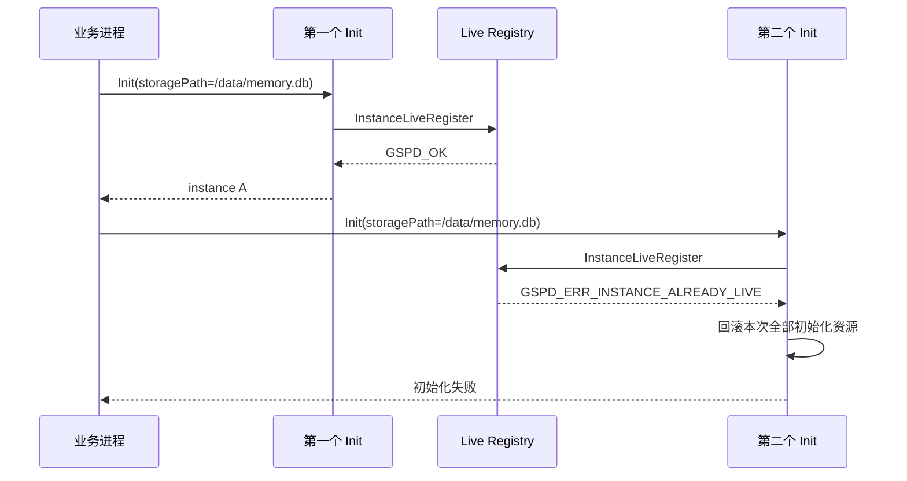

`GsPD_MemoryInit` 的输入是实例配置和输出地址；成功输出 live Instance；失败
输出错误状态且不留下需要调用方清理的半初始化对象。

##### GsPD_MemoryOpen

`GsPD_MemoryOpen` 在一个 live Instance 上创建轻量 handle，绑定本次
`userId/sessionId` 并装配 ServiceRouter；它不会重新创建 Store、LLM 或
MemoryRuntime。太初 JNI 每个临时 Instance 只 Open 一次，原生 C 调用方则
可以在同一 Instance 上创建多个 handle。

###### 外层用法、并发与重复规则

**1）同一 Instance 重复 Open。**

同一 live Instance 可以多次 Open，每次都返回新的 handle；相同 sessionId
也不会触发复用：

```text
Instance
├── Open(optsA) → handle A
├── Open(optsB) → handle B
└── Open(optsA) → handle C

handle A != handle C
```

A、B、C 必须分别 Close。

**2）并发 Open。**

顺序多次 Open 合法；并发 Open 当前没有公开的线程安全承诺，建议串行。

**3）Open 与 Finalize 并发。**

Open 与 Finalize 并发属于禁止用法，存在失效指针风险：

```text
线程 A：InstanceIsLive(inst) → 准备继续 Open
线程 B：Finalize(inst) → 释放 Instance
线程 A：继续读取 inst → 可能访问悬挂指针
```

**4）Open 失败。**

Open 失败时没有可用 handle，不调用 Close；Instance 仍需 Finalize。Finalize
后的旧 Instance 不得再次用于 Open。Open 失败不会销毁输入 Instance，修正
opts 或恢复资源后可以在该 live Instance 上重新 Open。

| 返回值                         | 典型情况                                                                                                            | 重试要求                                            |
| ------------------------------ | ------------------------------------------------------------------------------------------------------------------- | --------------------------------------------------- |
| `GSPD_ERR_INVALID_INPUT(-1)` | `inst/outMem` 为空、Instance 非 live、数值选项越界、`memoryMode` 非法，或创建 Router 时 Instance 依赖视图不可用 | 修正参数后重试；已 Finalize 的旧 Instance 不可恢复  |
| `GSPD_ERR_OOM(-4)`           | handle Talloc 上下文、handle、userId 副本或 Router 分配失败                                                         | 释放资源或恢复内存后，可在同一 live Instance 上重试 |

当前 Open 不会因 sessionId 已存在返回 `GSPD_ERR_SESSION_CONFLICT`；相同
sessionId 会创建不同 handle。`DreamRuntimeRegisterServiceRouter` 在已有其他
Router 时可能产生 `GSPD_ERR_CONFLICT(-18)`，但
`ServiceRouterRegisterForDream` 只记录 WARN，不把该状态返回给 Open，因此它
不属于 `GsPD_MemoryOpen` 的失败返回值；此时 Open 仍可能返回 `GSPD_OK`，
只是当前 handle 的 Router 没有登记为进程级 Dream Runtime Router。
调用方应在调用前令 `mem = NULL`，只有返回 `GSPD_OK` 后才对该 handle 调用
Close。

公开接口和选项结构为：

```c
GsPD_Status GsPD_MemoryOpen(
    GsPD_MemoryInstance *inst,
    const GsPD_MemoryOpenOpts *opts,
    GsPD_Memory **outMem);

typedef struct GsPD_MemoryOpenOpts {
    const char *sessionId;
    int memoryMode;
    int recentTurnsToKeep;
    float evictionRatio;
    int sessionTtlDays;
    const char *userId;
} GsPD_MemoryOpenOpts;
```

| 字段                  | 当前作用                                                                                  |
| --------------------- | ----------------------------------------------------------------------------------------- |
| `sessionId`         | 非空时复制到 handle；为空时依次使用`cfg.defaultSessionId` 和自动生成的 `_ephemeral_N` |
| `userId`            | 非空时复制到 handle；为空时依次使用`cfg.defaultUserId` 和 `GSPD_DEFAULT_USER_ID`      |
| `memoryMode`        | `0=ON_DEMAND`、`1=ACTIVE`，写入 Router；非法值由 Router 拒绝                          |
| `recentTurnsToKeep` | 当前只校验不得小于 0，尚未传入 ContextEngine                                              |
| `evictionRatio`     | 当前只校验`[0,1]`，尚未传入 ContextEngine                                               |
| `sessionTtlDays`    | 当前只校验不得小于 0，尚未传入 ContextEngine                                              |

Java 没有 Open 接口，JNI 为每次请求创建全零 `opts`，再按业务入口填入：

| Java 业务入口           | `opts.userId`   | `opts.sessionId`                    |
| ----------------------- | ----------------- | ------------------------------------- |
| Add、Clear、Trigger     | 请求 userId/uid   | 不设置                                |
| Store                   | 请求 userId       | 请求提供时设置                        |
| Atomic Search           | 请求 scope.userId | 不设置                                |
| Raw Conversation Search | 请求 scope.userId | 请求提供时设置                        |
| Global、Scene           | 请求 userId       | 当前实现同样使用 userId               |
| Dream                   | 请求 userId       | JNI 生成`dreaming:<userId>:<jobId>` |

`memoryMode`、`recentTurnsToKeep`、`evictionRatio`、`sessionTtlDays` 当前没有
Java/JSON 到 Open 的映射，保持全零。Open 的 session 是 handle/Router 上下文；
业务 Request 中的 sessionId 可能用于写入来源或检索过滤，两者不能混为一个
参数，因此 Add/Trigger、Store/Raw Search 的填充方式存在差异。

###### 内部调用链

```text
GsPD_MemoryOpen
└─ RuntimeMemoryOpen
   ├─ ValidateRuntimeOpenInputs
   │  ├─ 校验 inst / outMem / opts
   │  └─ InstanceIsLive
   ├─ TallocCreate
   ├─ TallocAlloc(GsPD_Memory)
   ├─ InitSessionAndUser
   │  ├─ InitSessionId
   │  └─ InitUserId
   └─ CreateServiceRouterForHandle
      ├─ InstanceGetMemoryRuntimeView
      ├─ InstanceGetContextView
      └─ ServiceRouterInit
```

###### 公开 API 层

```c
GsPD_Status GsPD_MemoryOpen(GsPD_MemoryInstance *inst,
    const GsPD_MemoryOpenOpts *opts,
    GsPD_Memory **outMem)
{
    GsPD_Status st = RuntimeMemoryOpen(inst, opts, outMem);
    if (st != GSPD_OK) {
        return LogMemoryOpenFailure(opts, st, "runtime-open");
    }
    return GSPD_OK;
}
```

公开层仍然只转发并记录错误；handle 的实际构造全部在 Runtime 层完成。

###### Runtime 层

Runtime 实现中的四个阶段与源码骨架如下。这里省略了日志参数，保留真实的
分配、失败清理和写出顺序：

```c
/* 阶段一：参数校验 */
GsPD_Status st = ValidateRuntimeOpenInputs(inst, opts, outMem);
if (st != GSPD_OK) {
    return st;
}
GsPD_MemoryOpenOpts defaults = { 0 };
const GsPD_MemoryOpenOpts *openOpts = opts ? opts : &defaults;

/* 阶段二：分配 handle */
TallocContext *tc = TallocCreate(0);
if (tc == NULL) {
    return GSPD_ERR_OOM;
}
GsPD_Memory *mem =
    (GsPD_Memory *)TallocAlloc(tc, sizeof(GsPD_Memory));
if (mem == NULL) {
    TallocDestroy(tc);
    return GSPD_ERR_OOM;
}
mem->tc = tc;
mem->inst = inst;
mem->userId = NULL;

/* 阶段三：参数与会话初始化 */
st = InitSessionAndUser(mem, openOpts, inst);
if (st != GSPD_OK) {
    TallocDestroy(tc);
    return st;
}

/* 阶段四：创建 ServiceRouter */
st = CreateServiceRouterForHandle(mem, openOpts);
if (st != GSPD_OK) {
    TallocDestroy(tc);
    return st;
}
*outMem = mem;
return GSPD_OK;
```

###### 第一步：校验 Instance 和 Open 参数

`ValidateRuntimeOpenInputs` 先检查 `inst/outMem`，随后调用 `InstanceIsLive`，最后
校验 Open 选项。live 检查发生在读取 Instance 内部字段之前，因此已经 Finalize
并从 registry 注销的旧地址会被拒绝，而不会继续进入正常 Open 流程。

主要选项约束包括：`recentTurnsToKeep` 和 `sessionTtlDays` 不得小于 0，
`evictionRatio` 必须处于 `[0, 1]`。`opts == NULL` 是合法输入，此时身份使用
配置默认值或自动生成值。

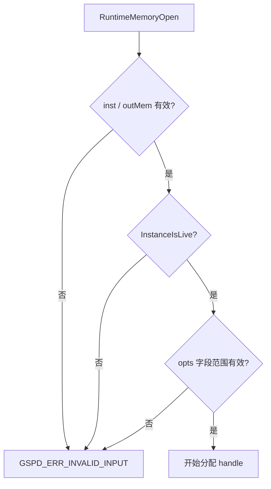

###### 第二步：创建 handle 私有内存

Open 为本次 handle 创建独立的 Talloc 上下文，再从该上下文分配
`GsPD_Memory`。内部结构如下：

```c
struct GsPD_Memory {
    GsPD_MemoryInstance *inst;
    ServiceRouter *router;
    TallocContext *tc;
    const char *userId;
    char sessionId[RUNTIME_SESSION_ID_MAX];
};
```

其中 `inst` 是借用指针；`router`、`userId` 和其他 handle 私有内存挂在
`tc` 下。Close 时销毁一次 `tc` 即可回收整个 handle 对象树。

###### 第三步：确定会话身份

身份优先级：

```text
sessionId：opts.sessionId -> defaultSessionId -> _ephemeral_N
userId：opts.userId -> defaultUserId -> GSPD_DEFAULT_USER_ID
```

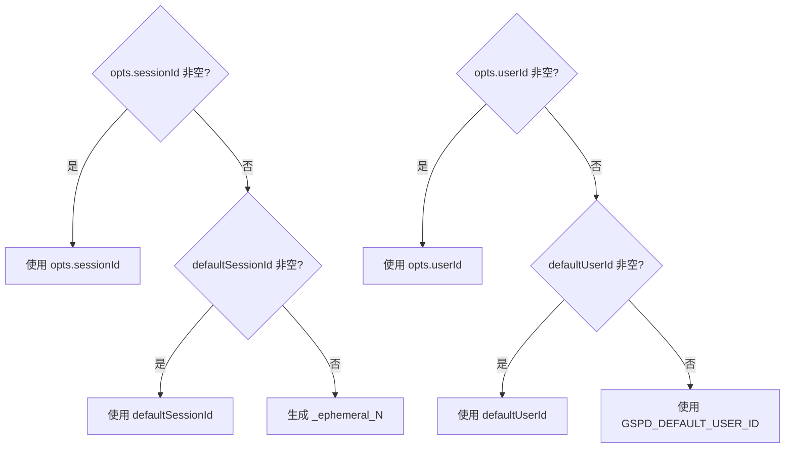

自动生成的 `_ephemeral_N` 只是在调用方没有提供任何 sessionId 时，为当前
handle 建立明确的运行上下文；它不是持久化会话恢复协议。

###### 第四步：为 handle 装配 ServiceRouter

Runtime 从 Instance 获取只读视图，把共享引擎和本次身份交给
`ServiceRouterInit`。剔除视图获取失败分支后，装配关系如下：

```c
ServiceRouterConfig routerCfg = {0};
routerCfg.mode = opts->memoryMode;
routerCfg.sessionId = mem->sessionId;
routerCfg.userId.ptr = mem->userId;
routerCfg.userId.len = strlen(mem->userId);

InstanceGetMemoryRuntimeView(inst, &memoryRuntime);
InstanceGetContextView(inst, &contextView);

ServiceRouterDeps routerDeps = {0};
routerDeps.tc = mem->tc;
routerDeps.memoryRuntime = memoryRuntime.engine;
routerDeps.contextEngine = contextView.engine;
routerDeps.llm = memoryRuntime.llm;

return ServiceRouterInit(
    &routerCfg, &routerDeps, &mem->router);
```

这里的关键不是“复制引擎”，而是“借用引擎”：两个 handle 会创建两个 Router，
但 Router 指向同一个 Instance 中的 MemoryRuntime、可选 ContextEngine 和 LLM。

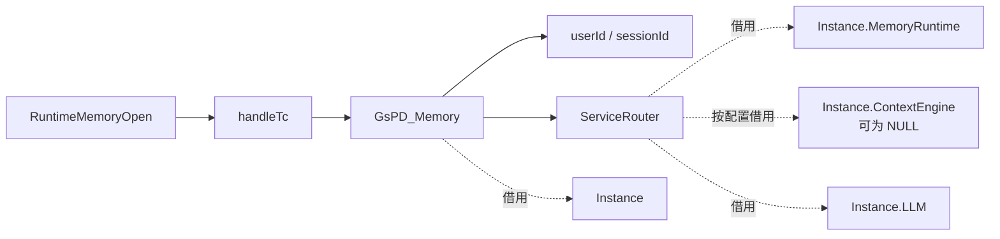

###### Open 失败清理

参数校验通过后，如果 handle 分配、身份复制或 Router 初始化任一步失败，
Runtime 都只销毁本次新建的 `handleTc`。Instance 和其他已经打开的 handle
不受影响，`outMem` 不会得到可用句柄。

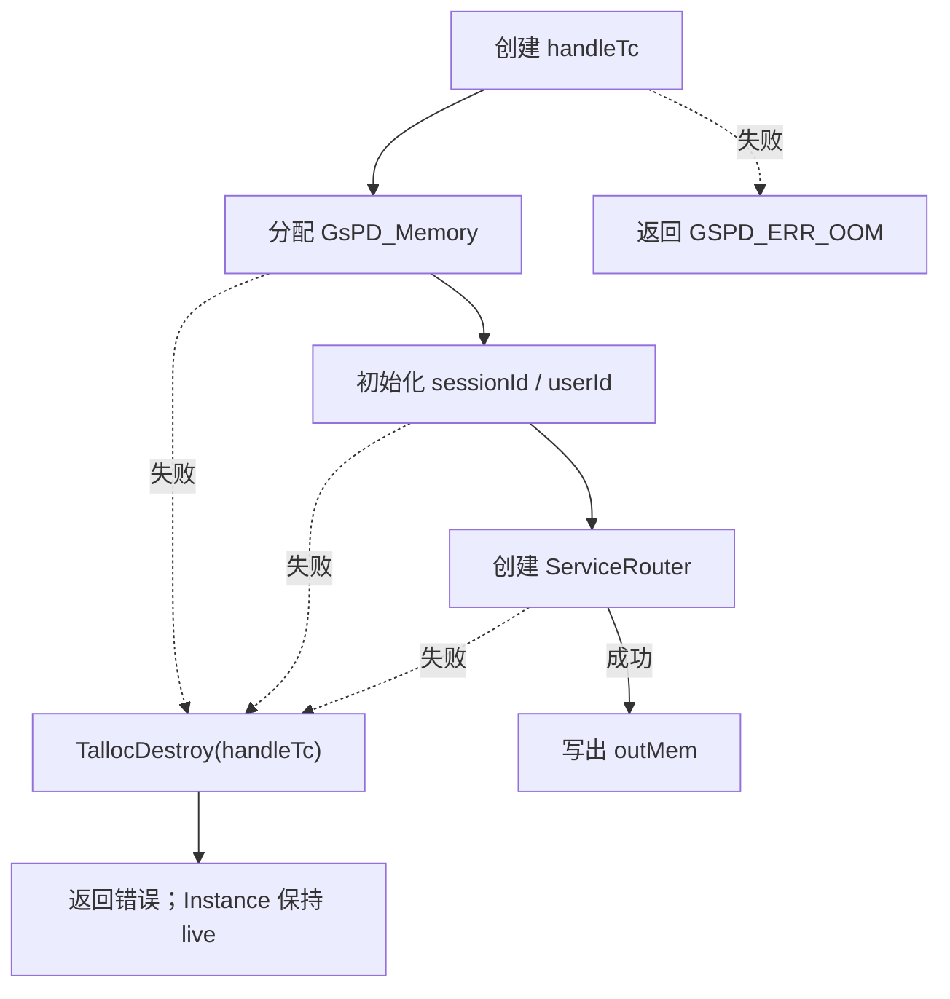

##### GsPD_MemoryClose

`GsPD_MemoryClose` 结束一个 handle 的运行期，不等同于删除某个用户的长期
记忆，也不等同于关闭整个记忆实例。太初 run-once 每次只关闭本请求的唯一
handle，并在其后立即 Finalize；原生 C 常驻模式才可能只关闭其中一个 handle。

###### 外层用法、并发与重复规则

**1）正常 Close 与重复 Close。**

每个成功 Open 的 handle 只 Close 一次，随后立即置 NULL：

```c
GsPD_MemoryClose(mem);
mem = NULL;

GsPD_MemoryClose(NULL); /* 合法，no-op */
```

不得重复关闭已经释放的非 NULL handle：

```c
GsPD_MemoryClose(mem);
GsPD_MemoryClose(mem); /* 非法：mem 已是悬挂指针 */
```

**2）同一个 handle 的并发 Close。**

同样禁止业务调用与 Close 交叉，也禁止两个线程同时 Close 同一个 handle：

```text
线程 A：使用 mem 执行业务 API
线程 B：Close(mem)              → 禁止
```

**3）两个不同 handle 的并发 Close。**

如果 A、B 是同一 Instance 上两个不同 handle，则关闭 A 不影响 B：

```text
线程 1：Close(handle A)
线程 2：Close(handle B)
```

当前实现中 A、B 拥有独立的 handle Talloc 上下文，Router 反注册也有互斥保护，
两次关闭不存在同一对象重复释放；但公开 C API 尚未承诺并发 Close 的线程安全，
因此对外规格不保证这种并发用法，宿主默认仍应串行 Close。

**4）Close 与 Finalize 的顺序。**

所有 handle 都必须没有在途业务调用，且全部 Close 完成后才能 Finalize
Instance。

###### 内部调用链

```text
GsPD_MemoryClose
└─ RuntimeMemoryClose
   ├─ mem == NULL 时直接返回
   ├─ 保存 mem->tc
   ├─ ServiceRouterDestroy(mem->router)
   ├─ mem->inst = NULL
   └─ TallocDestroy(handleTc)
```

###### 公开 API 层

```c
void GsPD_MemoryClose(GsPD_Memory *mem)
{
    RuntimeMemoryClose(mem);
}
```

完全委托 Runtime。

###### Runtime 层

```c
void RuntimeMemoryClose(GsPD_Memory *mem)
{
    if (mem == NULL) {
        return;
    }
    TallocContext *tc = mem->tc;
    ServiceRouterDestroy(mem->router);
    mem->inst = NULL;
    TallocDestroy(tc);
}
```

先把 `tc` 保存到局部变量，是因为 `mem` 自身也位于这个 Talloc 对象树中；
`TallocDestroy(tc)` 执行后，`mem`、`userId` 和 Router 占用的 handle 私有内存
都不再有效。

###### ServiceRouterDestroy 展开

`ServiceRouterDestroy` 省略日志和阶段注释后的核心实现如下：

```c
void ServiceRouterDestroy(ServiceRouter *router)
{
    if (router == NULL) {
        return;
    }

    DreamRuntimeUnregisterServiceRouter(router);

    router->memoryRuntime = NULL;
    router->contextEngine = NULL;
    router->llm = NULL;
    router->tc = NULL;
}
```

该函数按三个步骤结束 Router 的运行关系：

1. `router == NULL` 时直接返回，使 `ServiceRouterDestroy(NULL)` 成为 no-op；
2. 调用 `DreamRuntimeUnregisterServiceRouter` 反注册，解除进程级后台能力对
   当前 Router 的登记；该过程持有单例互斥锁，且仅在槽位地址与待关闭
   Router 完全相同时才会清空槽位；
3. 将 `memoryRuntime`、`contextEngine`、`llm` 和 `tc` 置空，明确断开 Router
   对共享资源及父级分配上下文的借用关系。

`ServiceRouterDestroy` 没有直接释放 Router 内存。Router 在 Open 时通过
`TallocAlloc(mem->tc, ...)` 挂到 handle 的 Talloc 父上下文下；函数返回后，
`RuntimeMemoryClose` 继续执行 `TallocDestroy(tc)`，Router 才与 handle、userId
一起被级联释放：

```text
ServiceRouterDestroy
├─ 解除后台登记
├─ 清空借用指针
└─ 不直接释放 Router
       ↓ 返回 RuntimeMemoryClose
TallocDestroy(handleTc)
└─ 级联释放 handle / Router / userId
```

该函数同样不会删除持久化长期记忆，也不会调用 ContextEngine 的 Purge 删除
会话数据。它结束的是当前 handle 的编排关系，而不是用户数据，也不会由 Close
函数自身销毁 Instance。

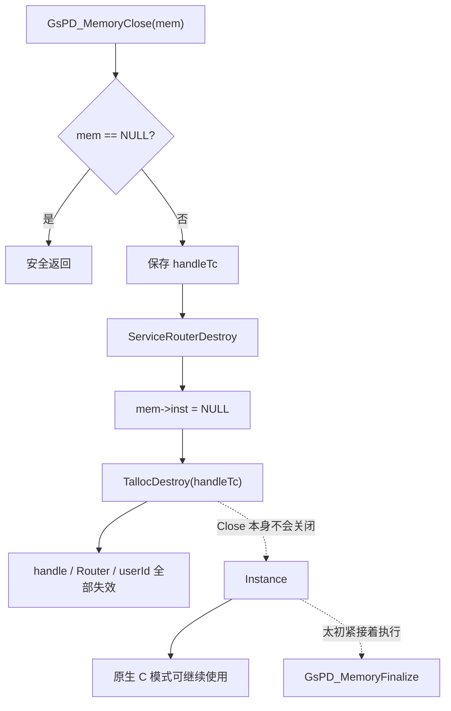

上述实现只结束当前 handle 的编排关系。这里的“关闭会话状态”指句柄已经
失效，不表示持久化数据被删除；原生 C 模式仍可在同一 Instance 上重新 Open，
并获得一个新的运行时 handle。

##### GsPD_MemoryFinalize

`GsPD_MemoryFinalize` 销毁整个 Instance。它与初始化失败共用同一套资源
注册表和逆序销毁机制，从而保证“如何创建”与“如何释放”成对出现。太初
run-once 中，它是一次外层请求的固定收尾动作；原生 C 模式下，它是常驻
Instance 生命周期的最终退出动作。

###### 外层用法、并发与重复规则

**1）Finalize 前置条件。**

Finalize 前必须完成以下顺序：

```text
停止接收新调用
→ 等待所有在途业务调用结束
→ Close 全部 handle
→ Finalize Instance
```

**2）正常 Finalize 与重复 Finalize。**

Finalize 后立即置 NULL；`Finalize(NULL)` 是合法的 no-op：

```c
GsPD_MemoryFinalize(inst);
inst = NULL;

GsPD_MemoryFinalize(NULL); /* 合法，no-op */
```

不得重复 Finalize 同一个非 NULL Instance。Finalize 后旧 Instance 不能继续
使用。

**3）Finalize 的并发边界。**

不得让 Finalize 与 Open、业务 API、handle Close 或另一个 Finalize 交叉。

**4）未关闭 handle 的风险与销毁结果。**

handle 内部借用 Instance：

```text
mem->inst ──借用──> Instance

Finalize(inst)
→ Instance 被释放
→ 未关闭 handle 的 mem->inst 成为悬挂指针
```

`GsPD_MemoryFinalize` 返回 `void`，不会报告“仍有 handle 未关闭”，调用顺序
完全由调用方保证。Finalize 只释放算端资源，不删除已持久化的数据。

基于此，标准的收尾是：

```
GsPD_MemoryClose(mem);
mem = NULL;

GsPD_MemoryFinalize(inst);
inst = NULL;
```

###### 内部调用链

```text
GsPD_MemoryFinalize
└─ RuntimeMemoryDestroy
   └─ InstanceDestroy
      ├─ inst == NULL 时直接返回
      ├─ InstanceLiveUnregister
      ├─ InstanceRollback(resourceRegistry)
      ├─ TallocDestroy(configTc)
      └─ TallocDestroy(rootTc)
```

###### 公开 API 层

```c
void GsPD_MemoryFinalize(GsPD_MemoryInstance *inst)
{
    RuntimeMemoryDestroy(inst);
}
```

###### Runtime 层

```c
void RuntimeMemoryDestroy(GsPD_MemoryInstance *inst)
{
    InstanceDestroy(inst);
}
```

这两层都只是转发，真正销毁在 InstanceDestroy。

###### Core 层

```c
void InstanceDestroy(GsPD_MemoryInstance *p)
{
    if (!p) {
        return;
    }
    if (!InstanceLiveUnregister(p)) {
        return;
    }

    TallocContext *rootTc = p->tc;
    InstanceRollback(&p->registry);
    if (p->configTc != NULL) {
        TallocDestroy(p->configTc);
        p->configTc = NULL;
    }
    TallocDestroy(rootTc);
}
```

Core 首先将 inst 从 live registry 删除，注销 live 状态。这样一旦 Finalize
开始，后续 Open 就不能再把该地址视为有效 Instance。若参数为 NULL，或者
地址已经不在 live registry 中，函数直接返回。后一分支可防止当前实现再次
执行资源销毁，但不改变公共调用约定：调用方仍不得再次使用旧指针，并应立即
将其置为 `NULL`。

随后这里复用初始化失败时的回滚机制 `InstanceRollback`，按注册顺序的反方向
释放共享资源。按当前 destroyer 登记顺序，先停 Scheduler，再销毁 Prompt、
可选 ContextEngine、MemoryRuntime，最后关闭对象存储、Storage、模型适配器和
基础互斥量。

```c
for (int i = registry->count - 1; i >= 0; --i) {
    InstanceDestroyFn fn = registry->destroy[i];
    void *ctx = registry->ctx[i];
    if (fn != NULL) {
        fn(ctx);
    }
}
registry->count = 0;
```

上面以 `registry` 作为文档变量名；源码函数 `InstanceRollback` 中对应参数名为
`r`。反向遍历本身就是 LIFO 语义的实现。

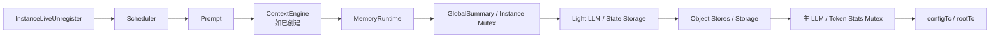

上述顺序的原则是“先销毁使用者，再销毁被依赖者”。例如 ContextEngine 和
MemoryRuntime 可能仍引用 Store 或 LLM，因此必须在 Store 和 LLM 之前销毁。

##### 2.1.3 接口设计

本 Story 不新增函数签名。核心契约是四个公开 C 生命周期 API；太初 Java/JNI
使用既有 `GsPDMemoryClient` 和 `GsPD_MemoryInitJson` 作为外层适配，不向
Java 暴露 C 指针。Java 业务方法与 C API 是“组合调用”关系，而不是一一对应：
一次 Java Add 会组合调用 InitJson、Open、MemoryAdd、Close、Finalize。

##### 2.1.3.1 不透明类型及完整内部布局

公开头文件只声明类型名称，不暴露字段，因此 Java/JNI 和原生 C 调用方都不能
依赖内部布局：

```c
typedef struct GsPD_MemoryInstance GsPD_MemoryInstance;
typedef struct GsPD_Memory GsPD_Memory;
```

设计实现中，`GsPD_MemoryInstance` 的完整内部字段如下。该结构定义在
`src/runtime/instance/include/instance_internal.h`，属于内部实现而非公开 ABI：

```c
struct GsPD_MemoryInstance {
    TallocContext *tc;
    TallocContext *adaptersTc;
    TallocContext *storesTc;
    TallocContext *memoryRuntimeTc;
    TallocContext *mcpTc;
    TallocContext *configTc;

    GsPD_MemoryInstanceConfig config;
    MemstoreSqliteDb backend;
    MemstoreSqliteDb stateBackend;
    void *memoryObjectBackend;
    void *stateObjectBackend;
    void *indexObjectBackend;
    TallocContext *objectStoreTc;
    int memoryObjectReady;
    int stateObjectReady;
    int indexObjectReady;
    int stateBackendReady;

    LlmAdapterVTable llm;
    LlmAdapterVTable lightLlm;
    char storagePath[INSTANCE_STORAGE_PATH_MAX];
    UtlMutex mutex;

    MemoryRuntimeContext *memoryRuntime;
    PipelineContextEngine *contextEngine;
    void *contextRepo;
    struct PromptCache *promptCache;

    TallocContext *globalSummaryTc;
    GsPD_MemoryStringSlice globalSummary;
    UtlMutex globalSummaryMutex;

    struct Scheduler *scheduler;
    struct PipelineSharedState *workerShared;

    InstanceTokenStats tokenStats;
    UtlMutex tokenStatsMutex;
    InstanceResourceRegistry registry;
    GsPD_MemorySchedulingConfig sched;
};
```

| 字段组                | 内部字段                                                                                                                   | 所有权和作用                                                                                                                                              |
| --------------------- | -------------------------------------------------------------------------------------------------------------------------- | --------------------------------------------------------------------------------------------------------------------------------------------------------- |
| Talloc 根和子上下文   | `tc`、`adaptersTc`、`storesTc`、`memoryRuntimeTc`、`mcpTc`、`configTc`、`objectStoreTc`、`globalSummaryTc` | `tc` 是 Instance 根所有者；其余上下文把适配器、Store、Runtime、JSON 配置、对象端口和 Global 摘要内存分区管理。Finalize 最终销毁根上下文，子树随之释放。 |
| 实际配置              | `config`、`sched`                                                                                                      | `config` 保存归一化后的完整 Instance 配置；`sched` 保存应用 preset 和显式覆盖后的实际调度参数。两者都属于 Instance，不是调用方借用的输入地址。        |
| 关系型兼容后端        | `backend`、`stateBackend`、`stateBackendReady`                                                                       | 保存管理用和可选独立状态 SQL 后端。当前三对象端口为 required 时，主关系型 Open/Schema 阶段会跳过；ready 标志用于避免销毁未成功打开的后端。                |
| 三对象端口            | `memoryObjectBackend`、`stateObjectBackend`、`indexObjectBackend` 及三个 `*Ready` 标志                             | 分别承载正式记忆对象、任务/水位状态和向量/关键词索引。后端对象由`objectStoreTc` 持有；ready 标志驱动失败回滚和 Finalize。                               |
| 模型                  | `llm`、`lightLlm`                                                                                                      | 主模型 VTable 提供 Chat、Embedding、Rerank 等能力；轻量模型用于可选低成本任务。适配器内部状态挂在`adaptersTc` 下。                                      |
| 生命周期身份和互斥    | `storagePath`、`mutex`                                                                                                 | `storagePath` 是 live registry 的同 path 互斥键；`mutex` 保护 Instance 内部共享状态。它们不能替代调用方对 Open/Finalize 顺序的协调。                  |
| 运行引擎              | `memoryRuntime`、`contextEngine`、`contextRepo`                                                                      | MemoryRuntime 是长期记忆管线入口；ContextEngine 按配置可选创建；Context Repo 保存会话上下文相关持久化访问。handle 和 Router 只借用这些共享资源。          |
| Prompt 与 Global 缓存 | `promptCache`、`globalSummaryTc`、`globalSummary`、`globalSummaryMutex`                                            | PromptCache 管理实例级 Prompt；Global 字段保存最近一次进程内摘要副本，并由独立 mutex 保护读写。正式 Global 结构化数据仍由 memoryStore 持久化。            |
| 后台执行              | `scheduler`、`workerShared`                                                                                            | Scheduler 由常驻模式创建并拥有；`workerShared` 是业务 worker 管理的跨 slot 状态借用指针。`stateless_task` 下 Scheduler 不启动。                       |
| 观测与回滚            | `tokenStats`、`tokenStatsMutex`、`registry`                                                                          | TokenStats 记录模型 token 统计；registry 按 Init 成功阶段登记 destroyer，初始化失败和 Finalize 都按逆序调用。                                             |

`GsPD_Memory` handle 的完整内部字段更少，定义在
`src/runtime/instance/include/runtime_memory_handle.h`：

```c
struct GsPD_Memory {
    GsPD_MemoryInstance *inst;
    ServiceRouter *router;
    TallocContext *tc;
    const char *userId;
    char sessionId[RUNTIME_SESSION_ID_MAX];
};
```

| 字段          | 所有权          | 作用                                                                                                                 |
| ------------- | --------------- | -------------------------------------------------------------------------------------------------------------------- |
| `inst`      | 借用            | 指向 Open 时传入的 live Instance。Close 只断开借用，不销毁 Instance；因此必须先 Close handle，再 Finalize Instance。 |
| `router`    | handle 私有     | 绑定当前 user/session 和 Instance 共享服务。Router 内部依赖仍是借用，Close 时先反注册并清空借用指针。                |
| `tc`        | handle 自有     | 当前 handle 的 Talloc 根上下文，拥有 handle 本体、Router 和复制后的 userId；Close 最终销毁该上下文。                 |
| `userId`    | handle 私有副本 | Open 根据 opts、Instance 默认值或系统默认值确定后复制，避免依赖调用方字符串生命周期。                                |
| `sessionId` | handle 内嵌数组 | Open 根据 opts、Instance 默认值或临时 ID 填充，供 Router 和会话级业务使用。                                          |

因此，“不透明”只表示外部调用方不得直接访问字段，不表示实现中没有内部状态。
外部只能通过公开 API 管理生命周期；内部代码则依据上述字段建立所有权、借用
关系和失败回滚顺序。

##### 2.1.3.2 实例初始化

```c
GsPD_Status GsPD_MemoryInit(
    const GsPD_MemoryInstanceConfig *config,
    GsPD_MemoryInstance **outInst);
```

| 参数        | 方向 | 说明                                                                           |
| ----------- | ---- | ------------------------------------------------------------------------------ |
| `config`  | in   | 完整 Instance 配置；字段来源和含义见 2.1.2 的“从`configJson` 构造 `cfg`” |
| `outInst` | out  | 成功时写入 live Instance                                                       |
| 返回值      | -    | `GSPD_OK` 成功；负值表示失败                                                 |

规格：

- `config/outInst` 不得为 NULL；
- 只有完整初始化并注册 live 后才写出 Instance；
- 同一非空且非 `:memory:` 的 storage path 不允许两个 live Instance；
- 成功对象必须通过 `GsPD_MemoryFinalize` 释放。

##### 2.1.3.3 JSON 实例初始化

```c
GsPD_Status GsPD_MemoryInitJson(
    const char *configJson,
    GsPD_MemoryInstance **outInst);
```

JSON 文本只需在调用期间有效。解析后的配置上下文挂到 Instance，并在 Finalize
时释放。`configJson` 必须是完整 JSON 内容，不能传配置文件路径；`outInst`
成功时得到 live Instance，失败时保持 NULL。该函数内部仍调用
`GsPD_MemoryInit`，不构成第五种 Instance 生命周期状态。

##### 2.1.3.4 会话打开选项

```c
typedef struct GsPD_MemoryOpenOpts {
    const char *sessionId;
    int memoryMode;
    int recentTurnsToKeep;
    float evictionRatio;
    int sessionTtlDays;
    const char *userId;
} GsPD_MemoryOpenOpts;
```

| 字段                  | 说明                                         |
| --------------------- | -------------------------------------------- |
| `sessionId`         | 当前会话标识；空时使用实例默认值或临时 ID    |
| `userId`            | 当前默认用户；空时使用实例默认值或通用默认值 |
| `memoryMode`        | 0=ON_DEMAND，1=ACTIVE                        |
| `recentTurnsToKeep` | 设计为压缩前保留轮数；当前只校验非负，未应用 |
| `evictionRatio`     | 设计为批量淘汰比率；当前只校验 0.0 到 1.0    |
| `sessionTtlDays`    | 设计为会话过期天数；当前只校验非负，未应用   |

##### 2.1.3.5 打开会话 handle

```c
GsPD_Status GsPD_MemoryOpen(
    GsPD_MemoryInstance *inst,
    const GsPD_MemoryOpenOpts *opts,
    GsPD_Memory **outMem);
```

| 参数       | 方向 | 说明                           |
| ---------- | ---- | ------------------------------ |
| `inst`   | in   | live Instance，不得为 NULL     |
| `opts`   | in   | Open 选项，可为 NULL           |
| `outMem` | out  | 成功时写入新 handle            |
| 返回值     | -    | `GSPD_OK` 成功；负值表示失败 |

规格：

- 每次成功 Open 都创建新 handle；
- Open 不保证相同 sessionId 幂等；
- Open 失败只回收本次 handle 资源；
- 成功 handle 必须通过 `GsPD_MemoryClose` 释放；
- 太初 JNI 当前每个 Instance 只调用一次 Open；多次 Open 是原生 C 保留能力。

##### 2.1.3.6 关闭会话 handle

```c
void GsPD_MemoryClose(GsPD_Memory *mem);
```

- `mem == NULL` 是安全 no-op；
- 非 NULL handle 只允许关闭一次；
- Close 后调用方必须停止使用旧指针，建议立即置 NULL；
- Close 不销毁 Instance 或持久化记忆；
- 太初 JNI 在 Close 后立即 Finalize，但 IDS 中已写入的数据继续存在。

##### 2.1.3.7 销毁实例

```c
void GsPD_MemoryFinalize(GsPD_MemoryInstance *inst);
```

- `inst == NULL` 是安全 no-op；
- 调用前必须先 Close 所有 handle；
- 调用后旧 Instance 地址不得用于业务调用；
- 调用方应立即将旧指针置为 NULL，不以 live registry 的内部防御作为重复
  Finalize 契约；
- 契约上禁止再次用旧地址 Open。地址未被复用时，当前 live registry 返回
  `GSPD_ERR_INVALID_INPUT`；但 registry 只比较裸指针，不能作为悬空指针的
  绝对检测机制。

##### 2.1.3.8 调用示例

以下是原生 C 的通用写法；太初 Java 调用方不直接执行这些语句，而由 JNI
run-once 在一次业务方法内部执行等价流程：

```c
GsPD_MemoryInstance *inst = NULL;
GsPD_Memory *mem = NULL;

GsPD_Status st = GsPD_MemoryInit(&config, &inst);
if (st != GSPD_OK) {
    return st;
}

st = GsPD_MemoryOpen(inst, &openOpts, &mem);
if (st != GSPD_OK) {
    GsPD_MemoryFinalize(inst);
    return st;
}

/* 使用 mem 调用业务 API。 */

GsPD_MemoryClose(mem);
mem = NULL;
GsPD_MemoryFinalize(inst);
inst = NULL;
```

#### 2.1.4 规格约束

本节只汇总必须遵守的契约；各函数的参数、错误分支和内部实现以前文为准。

| 类别             | 约束                                                                                                                                                                                                                                               |
| ---------------- | -------------------------------------------------------------------------------------------------------------------------------------------------------------------------------------------------------------------------------------------------- |
| 太初请求边界     | 一次 Java 业务请求在 JNI 内创建一个临时 Instance 和一个 handle，并在返回 Java 前完成 Close、Finalize。                                                                                                                                             |
| 持久化边界       | Close/Finalize 只回收算端对象，不删除已经写入 IDS 的长期数据。                                                                                                                                                                                     |
| 初始化           | 只有全部 Stage 成功并登记 live 后才输出 Instance；失败时按 LIFO 回滚。                                                                                                                                                                             |
| Open             | 仅接受 live Instance；每次成功都返回新 handle，不按 sessionId 复用。                                                                                                                                                                               |
| 所有权           | Instance 拥有 Store、模型和 Runtime；handle 拥有身份副本和 Router，并借用 Instance 资源。                                                                                                                                                          |
| 关闭顺序         | 停止新调用并等待在途业务结束，Close 全部 handle，再 Finalize Instance；调用后立即将所有持有该地址的指针置 NULL。                                                                                                                                   |
| 悬挂指针禁用项   | 禁止重复 Close 同一非 NULL handle、重复 Finalize 同一非 NULL Instance、Close 后继续调用业务 API、Finalize 后继续 Open/访问，以及保留未同步置 NULL 的别名。Close(NULL) 和 Finalize(NULL) 才是安全 no-op；live registry 不能作为绝对的悬挂指针检测。 |
| 同一对象并发销毁 | 禁止两个线程同时 Close 同一 handle 或同时 Finalize 同一 Instance；禁止业务调用与其 handle 的 Close 交叉；禁止 Open、业务调用或 Close 与所属 Instance 的 Finalize 交叉。调用方必须在生命周期 API 外部完成停流和等待在途调用。                       |
| 并发 Open        | 稳定 live Instance 可拥有多个 handle，但当前公开接口未承诺多个 Open 或后续业务 API 的线程安全；除非具体接口另有说明并经过验证，宿主应串行 Open 和共享 Instance 上的业务访问。                                                                      |
| 同 path Init     | 同一非空、非`:memory:`的最终 storagePath 只允许一个 live Instance；后到的 Init 返回`GSPD_ERR_INVALID_INPUT`并回滚。当前 IDS 默认 fallback 为`gspd_memory.db`，因此太初 run-once 应串行。                                                     |
| 不同 path Init   | registry 允许两个 Instance 共存，但不提供整体并发安全保证。InitJson 会触及进程级日志、环境配置和调试目录；仅改变 fallback path 不能隔离共享 IDS 或其他全局资源，当前仍应由宿主串行 InitJson。                                                      |

#### 2.1.5 外部依赖

| 依赖                                        | 生命周期作用                            | 失败处理                                                      |
| ------------------------------------------- | --------------------------------------- | ------------------------------------------------------------- |
| Talloc                                      | 管理 Instance 和 handle 的分层内存      | 分配失败返回 OOM；父上下文销毁时级联释放                      |
| Store/IDS Adapter                           | 创建 memory、state、index 三对象端口    | Init 失败并回滚已创建端口                                     |
| LLM Adapter                                 | 提供 Chat、Embedding 和可选 Rerank      | 按适配器策略失败或降级                                        |
| MemoryRuntime、ContextEngine、ServiceRouter | 执行业务管线并把 handle 连接到 Instance | Instance 组件失败导致 Init 失败；Router 失败只回收本次 handle |
| Scheduler/Worker                            | 常驻模式的后台任务                      | `stateless_task` 不启动；常驻模式随 Instance 销毁           |

#### 2.1.6 兼容性分析

| 维度        | 结论                                                             |
| ----------- | ---------------------------------------------------------------- |
| C API/ABI   | 不修改函数签名；Instance 和 handle 继续保持公开不透明。          |
| Java/JNI    | Java 业务接口不变，JNI 继续组合既有生命周期 API。                |
| 配置        | 继续接受现有 configJson；已读取、部分读取和未读取字段见 2.1.2。  |
| IDS 数据    | 不修改 collection 或持久化格式，Close/Finalize 不删除数据。      |
| 原生 C 模式 | 保留常驻 Instance 和多 handle 能力，不受太初单 handle 用法限制。 |

#### 2.1.7 性能分析

太初 run-once 的主要成本在 Init/Finalize，而不是 Open/Close：

| 阶段       | 成本判断                                                 |
| ---------- | -------------------------------------------------------- |
| Init       | 装配 Store、模型和 Runtime，是主要冷启动成本。           |
| Open/Close | 只处理 handle、身份和 Router，相对轻量。                 |
| Finalize   | 逆序关闭本次 Instance 资源，也是每个太初请求的固定成本。 |

性能评估应测量完整 Java 请求的总耗时和 Init/业务/Finalize 分段耗时，不能用
常驻 Instance 的理论成本替代当前 run-once 实测。

#### 2.1.8 小型化影响分析

本 Story 不新增代码和持久化格式。太初请求结束后释放 Instance/handle，
常驻内存只保留进程级设施；原生端侧仍可选择常驻 Instance。关闭 Context、
Rerank 或轻量模型可以减少可选组件开销。

#### 2.1.9 DFX设计

现有日志能够沿以下层次定位失败：

```text
Java operation/traceId
  → JNI run-once 阶段
  → 公开 API 与 Runtime 原因
  → Instance Init Stage
```

建议补充三个请求级指标：完整 run-once 总耗时、Init/业务/Finalize 分段耗时、
请求返回时的 live Instance 数。当前没有全局 handle 计数，不描述为已有能力。

#### 2.1.10 安全设计

| 风险          | 边界要求                                                                                    |
| ------------- | ------------------------------------------------------------------------------------------- |
| 身份和 scope  | userId/sessionId 只是业务隔离上下文，不是认证凭据；最终隔离仍由请求 scope 和 IDS 过滤保证。 |
| 失效指针      | Close/Finalize 后立即置 NULL；禁止并发使用和销毁同一对象。                                  |
| 配置密钥      | 优先从环境变量读取，不在日志、文档示例或提交文件中暴露真实值。                              |
| 过早 Finalize | 当前没有 handle 引用计数，必须由宿主保证先关闭全部 handle。                                 |

#### 2.1.11 其他可靠性分析

| 失败点                 | 当前行为                              | 调用方处理                               |
| ---------------------- | ------------------------------------- | ---------------------------------------- |
| Init 参数或配置非法    | 返回负状态，不输出可用 Instance       | 修正配置后重新执行完整生命周期           |
| Init Stage 失败        | 已登记资源按逆序回滚                  | 不调用 Finalize                          |
| Open 失败              | 回收本次 handleTc，Instance 保持 live | Finalize 已创建的 Instance               |
| 业务失败               | JNI 仍执行 Close/Finalize             | 返回原业务状态；是否重试由业务幂等性决定 |
| Close/Finalize         | 无单独销毁结果                        | 依靠正确顺序、日志和资源观测             |
| 请求结束仍有 live 对象 | 违反 run-once 契约                    | 通过阶段日志和集成测试定位遗漏           |

### 2.2 可测试性分析及建议

| 测试接缝                                       | 可验证内容                                  |
| ---------------------------------------------- | ------------------------------------------- |
| `InstanceInitForTest`、Stage fault injection | 初始化失败点与 LIFO 回滚                    |
| live registry                                  | 同 path 互斥、Finalize 后重新 Init          |
| Open 与 Router Mock                            | 身份默认值、参数边界、Open 失败清理         |
| Talloc/ASAN                                    | handle、Router、Instance 是否泄漏或越界访问 |
| JNI run-once helper                            | Java 请求中的创建、业务和清理顺序           |

必须覆盖四类场景：正常 run-once、Init/Open/业务失败清理、IDS 跨请求持久化、
原生 C 多 handle。

## 3 Story测试分析和设计

### 3.1 测试策略

| 层级 | 重点                                                   |
| ---- | ------------------------------------------------------ |
| UT   | 生命周期参数、Stage 回滚、live registry、handle 所有权 |
| ST   | JNI run-once 成功/失败清理和 IDS 跨请求持久化          |
| SDV  | Java Add/Search/Trigger/Dream 的完整请求级生命周期     |

现有 ST/SDV 资产必须保留；新增用例用于补充生命周期覆盖，不替换或删除旧套件。

### 3.2 相关测试接口

测试复用 2.2 所列接缝，重点观察：destroyer 逆序调用、Router 创建/销毁次数、
live 状态变化，以及 JNI 是否在所有返回分支完成清理。

### 3.3 自动化分析和设计

相关代码发生修改时执行：

```text
./build.sh format
./build.sh lint
./build.sh test --coverage
./build.sh verify
```

覆盖率不得低于 80%，并通过 ASAN；不得跳过测试、排除文件或降低门禁。

## 4 LLT测试用例（必选）

| 用例编号 | 场景                  | 操作                                               | 预期结果                                                      |
| -------- | --------------------- | -------------------------------------------------- | ------------------------------------------------------------- |
| LLT-001  | 正常 Init/Finalize    | 有效配置创建并销毁 Instance                        | Init 成功；Finalize 后 live 状态注销                          |
| LLT-002  | Init 参数非法         | config 或 outInst 为 NULL                          | 返回`GSPD_ERR_INVALID_INPUT`，无半初始化对象                |
| LLT-003  | Init Stage 失败       | 对任一 Stage 注入失败                              | 已创建资源按逆序且只销毁一次                                  |
| LLT-004  | storagePath 互斥      | A live 时用相同 path Init B；A Finalize 后重试     | 首次拒绝 B；A 销毁后可重新 Init                               |
| LLT-005  | 正常 Open             | live Instance 配合显式或空身份 opts                | 返回 handle；身份按 opts、Instance 默认值、系统默认值依次回退 |
| LLT-006  | Open 参数/Router 失败 | 非 live Instance、越界 opts 或 Router Mock 失败    | 返回错误，只释放本次 handle 资源                              |
| LLT-007  | 重复 session Open     | 相同 sessionId 连续 Open 两次                      | 返回两个不同 handle                                           |
| LLT-008  | 多 handle 与 Close    | Open A/B，Close A 后继续使用 B；另测 Close(NULL)   | B 保持可用；NULL 调用不崩溃                                   |
| LLT-009  | Finalize 顺序         | Close 全部 handle 后 Finalize；另测 Finalize(NULL) | 资源逆序释放；NULL 调用不崩溃；旧指针不再使用                 |
| LLT-010  | JNI 正常 run-once     | 执行代表性 Java 业务请求                           | 创建一个 Instance/handle，并按业务后 Close/Finalize           |
| LLT-011  | JNI 异常清理          | 分别注入 Open 和业务失败                           | Open 失败只 Finalize；业务失败仍 Close/Finalize               |
| LLT-012  | IDS 跨请求持久化      | Add 请求结束后用新 Search 请求读取同一 scope       | 新 Instance 能读取此前 IDS 数据                               |
| LLT-013  | 当前 IDS Init 重叠    | A 使用当前 JSON 保持 live，再次 InitJson           | fallback storagePath 冲突，返回`GSPD_ERR_INVALID_INPUT`     |
| LLT-014  | 不同 path Init 边界   | A live 时以另一独立 path Init B，再分别访问和销毁  | 不触发 path 互斥；两实例可登记 live，资源互不误释放           |

不得把重复 Close 已释放地址或复用 Finalize 后旧地址设计成普通可恢复用例；此类
悬空访问只通过所有权审查和 ASAN 发现。
