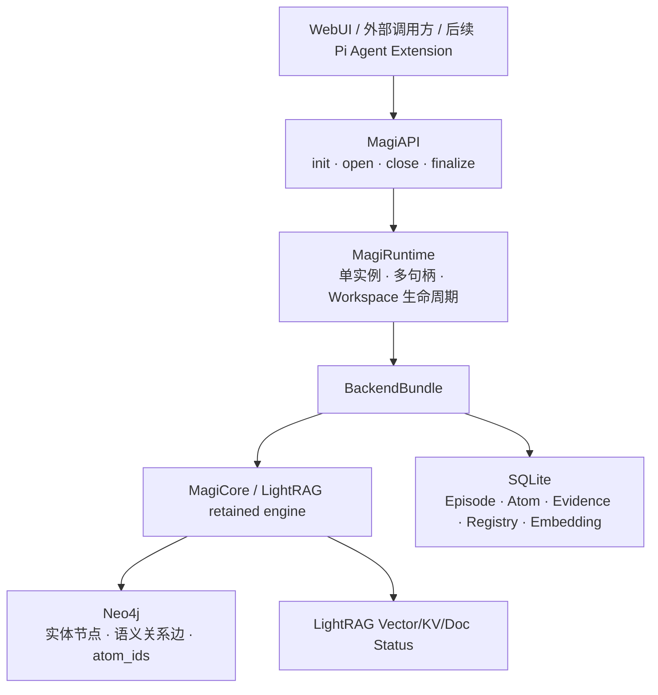

# MAGI Memo 二期工程验收与三期交接报告

日期：2026-08-10  
文档状态：二期最终汇总，替代各阶段进度文档中的历史结论

## 1. 验收结论

MAGI Memo 二期已经达到 **功能完成、可以进入三期工程** 的状态。

二期的核心目标已经实现：在保留 LightRAG 成熟的文档队列、图谱、向量检索、删除和 WebUI
能力的基础上，建立了以 Episode、Atom、Evidence、双时间和实体消歧为中心的记忆系统；同时完成
公开 API、Runtime、单实例多句柄和多 Workspace 隔离。

但如果“完成”要求达到可以长期无人值守运行的生产可靠性标准，目前只能判定为
**有条件完成**，还有两项应在三期正式接入 Agent 前优先收尾：

1. `projection_outbox` 只有数据表和状态统计，尚未实现写入、幂等重放和 reconcile worker；
   SQLite 已提交而 Neo4j/VDB 投影失败时，仍可能产生跨存储不一致。
2. 真实 Neo4j 回归中，`search_labels()` 在全文索引暂时返回空结果时不会进入 `CONTAINS`
   fallback，导致一项测试失败。它不阻断 Atom 写入，但会影响图谱标签搜索的稳定性。

双时间 query-time 过滤、跨存储一键恢复、Reflect 聚类与 `global.md`、Agent 主动图谱探索和
更新，均是已经明确延期的能力，不应误判为本轮遗漏。

## 2. 二期最终架构



三层分工已经稳定：

| 层 | 责任 | 不负责 |
|---|---|---|
| `interface` | 稳定公开契约、调用者句柄、ingest/search/status/extension | 直接创建或销毁底层存储 |
| `magi_runtime` | 实例生命周期、句柄并发、Workspace 切换、Backend 组装 | 记忆语义与图谱合并 |
| `magi_core` | 抽取、消歧、Atom 裁决、持久化、图投影和检索 | 上层 Agent 会话生命周期 |

这层边界使后续 Agent 只依赖 `MagiAPI`，不会持有 SQLite、Neo4j 或 LightRAG 的资源对象。

## 3. 核心记忆模型

统一模型定义在 `src/magi_core/memory/models.py`。

### 3.1 Episode

Episode 是一次需要进入记忆系统的输入，当前支持：

- `document`：用户主动上传的文档或文本文件；
- `conversation`：由外层 Agent 选择后提交的对话片段；
- `multimodal_text`：未来多模态层生成的描述文本。

Episode 保存原文、来源、参考时间、创建时间和处理状态。文档和对话虽然共用写入管线，但证据
始终能够回溯到各自的 Episode 原文。

### 3.2 Entity 与 Relation

`EntityRecord` 保存稳定 Entity ID、规范名称和别名集合。别名不仅参与全文召回，也分别持久化
embedding，因此实体消歧不是只比较主名称。

`RelationRecord` 保存稳定 Relation ID、两端 Entity ID、两端实体名称和语义关键词。方案 B 没有
把关系退化成无语义的连接：关系的具体语义仍由 Relation Atom 的 `predicate/content` 表达，并物化
到 Neo4j 关系的 `description` 和 `keywords`。

### 3.3 Atom 与 Evidence

Atom 是记忆的基础单位，但不是 Neo4j 节点。Atom 作为独立记录保存在 SQLite，通过
`owner_id` 归属于一个 Entity 或 Relation；ID 前缀已经可以区分 owner 类型，无需重复保存
`atom kind` 和 `owner kind` 两套同义字段。

一个 Atom 可以被多个 Episode 支持：

```text
Atom 1 ─── N AtomEvidence N ─── 1 Episode
```

`AtomEvidence` 是关系表中的一行，而不是 Atom 上的单值字段。相同 Atom 再次出现时复用 Atom，
新增 Evidence，并按不同 Episode 更新 `support_count`。这样既不复制语义事实，也能高效查询来源。

### 3.4 双时间

Atom 同时保存两套时间：

| 字段 | 含义 | 写入/更新时机 |
|---|---|---|
| `valid_at` | 事实开始在现实世界中成立的时间 | 模型从文本推断；缺省使用 Episode 参考时间 |
| `invalid_at` | 事实从现实世界中不再成立的时间 | 文本明确给出，或时间继任/显式取代时写入 |
| `created_at` | 记录进入 MAGI 的系统时间 | 首次持久化 Atom 时写入 |
| `expired_at` | 记录不再参与当前物化的系统时间 | Refinement、Temporal Successor 或显式取代时写入 |

`invalid_at` 表示“该陈述的有效区间结束”，并不自动证明反命题成立。给模型的 Atom 表示会同时携带
内容、状态和时间，避免把“失效”误解为“取反”。

## 4. 写入链路


### 4.1 原始 Episode 写入

`MagiHandle.ingest()` 和 `ingest_file()` 复用 LightRAG 已验证的队列、文档状态、chunk、重试与
删除入口。区别在于抽取 Prompt 已经按 MAGI 的任务语义修改：模型在同一次抽取调用中直接返回
实体、初始别名、语义关系、Entity/Relation Atom 和双时间，而不是对旧 LightRAG 结果做事后
规范化。

多 chunk 文档仍可能产生多次并行抽取调用；“一次抽取”指每个 chunk 内实体、关系与 Atom 同锅
生成，不表示任意长度文档永远只有一次 LLM 调用。

### 4.2 已抽取输入

`MagiHandle.ingest_extracted()` 接受 `ExtractedMemory`，跳过第一阶段 LLM 抽取，但仍进入耐久写入
链路，完成 Episode/Chunk 登记、实体消歧、Atom 裁决、Evidence、投影和删除记账。它用于未来
外层 Agent 已经在当前对话推理中完成结构化提取的场景。

### 4.3 实体消歧

实体处理顺序如下：

1. 同一 Episode 内先按主名称和模型给出的别名归并；
2. 使用 SQLite exact/lexical/FTS，以及主名称和别名 embedding 召回候选；
3. 为候选补充近期 Atom 表示和近期 Episode 上下文；
4. 将本轮所有存在候选的实体组织为一次 LLM 请求；
5. 每个新实体只能合并到自己的候选集合之一，或作为新实体插入；
6. 被合并的本轮名称进入目标实体别名；
7. 统一重写本轮关系端点，再进入 Relation 合并。

当前假设既有实体集合彼此无需再次合并；“发现旧实体之间也应合并并打标，等待 Reflect 处理”的
beta 分支没有启用。

### 4.4 Atom 候选与单批裁决

Atom 候选严格按 owner 隔离，Entity Atom 不会和 Relation Atom 混比，不同实体/关系之间也不会
互相匹配。

- owner 历史 Atom 不超过 16 条：全部提供给模型；
- 超过 16 条：embedding Top-K 8、近期 active 4 条和 owner summary；
- owner 内规范化文本、有效状态和 `invalid_at` 完全相同：本地直接判为 DUPLICATE；
- 其余本轮 Atom 目前组成 **一次 Episode 级结构化 LLM 调用**，而不是每个 Atom 单独调用；
- 虽然是全局单批，请求中每个 Atom 的候选 ID 仍然独立校验，模型不能跨 owner 选择目标；
- 格式错误、越权候选或调用异常会安全降级为 INDEPENDENT，避免错误覆盖历史记忆。

典型单 chunk 对话 Episode 的 LLM 成本为：抽取一次、存在实体候选时消歧一次、存在 Atom 候选时
裁决一次；超过描述阈值后，LightRAG summary 还会按 owner 产生额外调用。无候选阶段会跳过，完全
重复 Atom 可本地短路。

### 4.5 五类 Atom 操作

| 决策 | 持久化行为 | 时间行为 | 演化记录 |
|---|---|---|---|
| `DUPLICATE` | 复用目标 Atom，只增加 Evidence | 保持目标时间 | 不建立新 Atom 演化 |
| `INDEPENDENT` | 插入新 Atom | 使用新 Atom 时间 | 无 |
| `REFINEMENT` | 插入更精确的新 Atom | 旧 Atom 写 `expired_at`，不臆造 `invalid_at` | 新 → 旧 |
| `TEMPORAL_SUCCESSOR` | 插入后续状态 | 旧 Atom 写转折点 `invalid_at` 和 `expired_at` | 新 → 旧 |
| `CONTRADICTION` | 默认并存；仅显式 `supersedes_target` 才取代 | 显式取代时更新旧 Atom 两类结束时间 | 新 → 旧 |

演化关系保存在 `atom_evolution`，包含 source/target Atom ID、决策、置信度和原因；因此五分类不是
Atom 表上的一个固定字段。一次 Atom 可以在不同演化记录中扮演不同角色，详情可通过
`list_atom_evolutions(atom_id)` 查询，WebUI Atom detail 也会展示相关信息。

## 5. 存储与图投影

### 5.1 SQLite 独立记录层

每个 Workspace 的 `ragstore` 内保存 `magi-memory.db`。主要表包括：

- `episodes`；
- `atoms` 与 `atom_evidence`；
- `atom_evolution`；
- `entity_registry`、`relation_registry`、`entity_aliases`；
- FTS5 实体名称索引；
- `memory_embeddings`；
- `workspace_settings`；
- `memory_deletion_backups`；
- `projection_outbox`（目前只有 schema 和统计）。

embedding 以 BLOB 持久化在 SQLite，由 NumPy 做轻量相似度检索。当前数据规模和单机个人记忆系统
目标下，这比再引入独立向量服务更易部署；未来数据规模增大时可以在保持接口不变的前提下替换。

### 5.2 Neo4j 保持语义属性图

Neo4j 仍保存原 LightRAG 形态的实体节点和有语义关系边。Entity/Relation 属性包含：

- 稳定 MAGI owner ID；
- `atom_ids` 列表；
- 从该 owner 当前未过期 Atom 按写入顺序物化的 `description`；
- 关系端点、关键词、来源和 LightRAG 检索所需属性。

Atom 的内容、时间、权重和 Evidence 不在图属性中重复保存；需要详情时通过 `atom_ids` 回到
SQLite。这既规避 Neo4j property 不能保存嵌套对象的问题，也保留 LightRAG 原有实体探索和语义
关系检索。

### 5.3 描述总结与数据血缘

当 owner 的合并描述超过 LightRAG 阈值时，继续使用原有 summary/map-reduce 工程机制。当前默认
`FORCE_LLM_SUMMARY_ON_MERGE=8`，实际调用次数按触发 owner 和 map-reduce 分片决定，不承诺整轮写入
最多四次。

MAGI 的区别是 summary 输入来自 Atom presentation，而非自由堆叠的旧描述。Prompt 要求总结中的
每一段信息保留 `[atom-id]` 血缘标签；代码会校验输出标签集合与输入 Atom 标签集合一致。标签丢失、
伪造或不完整时，不采用该总结，回退到原始 Atom 列表描述。`atom_ids` 属性仍独立保存，文本标签
用于让被召回的 description 本身具备可解释血缘。

## 6. 删除、备份和一致性

单 Episode 硬删除已经适配 MAGI 数据：

1. 删除前将该 Episode、Evidence、受影响 Atom/owner 等数据写入 SQLite 备份；
2. 删除 Episode Evidence；
3. 仅删除已经没有任何 Evidence 的孤立 Atom；
4. 清理相关 embedding 和 evolution；
5. 更新 Atom `support_count` 与 owner `atom_ids`；
6. 对仍存在的 owner 重物化 description，并刷新 Neo4j/VDB；
7. 没有 Atom 的 owner 从图和 registry 中移除。

`clear` 也会先为 Episode 建立备份，再清理 MAGI registry。SQLite 已提供
`restore_episode_backup()`，但它只是记录层恢复原语，还没有形成恢复 SQLite 后自动重投影
Neo4j/VDB 的公开端到端命令。

当前最大的一致性风险是：SQLite 与 Neo4j/VDB 不共享事务。`projection_outbox` 原本用于把“待投影”
变成可恢复事件，但目前提交路径没有写 outbox，也没有 retry/reconcile worker。三期 Agent 产生持续
写入前，应优先完成该机制。

## 7. Runtime、Workspace 与公开接口

### 7.1 生命周期

公开调用链已经按预定层次实现：

```text
MagiAPI.init/finalize 或 open/close
    → MagiRuntime.instance_init/instance_destroy/open_handle/close_handle
        → BackendBundle.initialize/finalize
            → MagiCore + SQLite + Neo4j facade
```

一个进程内只允许一个 active Runtime 实例，但可打开多个独立 Handle。Handle 调用会计入
`in_flight`；`close` 和 `finalize` 先停止接收新工作，再等待在途调用排空。Runtime 绑定创建它的
asyncio event loop，不支持跨 loop 使用，也不考虑同一进程多次并行 `init`。

### 7.2 Workspace

Workspace 不再由 `.env` 写死为唯一值。`WorkspaceManager` 持久化 Workspace registry 和当前 active
ID：

- 原 `mgc-test` 作为默认本地 Workspace；
- 新 Workspace 创建在统一 home 下的 `workspaces/<workspace_id>`；
- 每个 Workspace 有独立 `ragstore`、SQLite DB 和 LightRAG/Neo4j workspace namespace；
- 切换前要求所有公开 Handle 关闭，然后销毁旧 BackendBundle、初始化新实例；
- WebUI 可以列出、创建和切换 Workspace，并显示当前 Workspace 的 Memory/Graph/Console/Logs。

### 7.3 当前公开 API

正式入口为 `src/interface/api.py::MagiAPI`，目前提供：

| 类别 | 接口 |
|---|---|
| 生命周期 | `build/from_engine`、`init`、`finalize`、`open`、`close` |
| Workspace | `list_workspaces`、`create_workspace`、`switch_workspace` |
| 原始写入 | `MagiHandle.ingest`、`ingest_file` |
| 已抽取写入 | `MagiHandle.ingest_extracted` |
| 检索 | `MagiHandle.search`，复用 `local/global/hybrid/mix/naive` |
| 运行状态 | `MagiHandle.status` / `MagiAPI.status` |
| 上层扩展 | `register_extension`、`MagiHandle.extension` |

`index/query` 只保留为一期兼容别名。公开 API 还没有开放 delete/restore/rebuild、时间点查询或图谱
探索写接口；其中 update/forget/主动探索此前已经明确延期到三期语义设计之后。

## 8. WebUI 当前能力

WebUI 已从 LightRAG 壳层迁移到 `src/webui` 并继续构建到服务端静态目录。当前可以：

- 上传文件或文本 Episode，并查看写入队列和处理状态；
- 查看 Episode、Atom、Evidence、Entity、Relation 和 Atom 演化详情；
- 查看 Neo4j semantic graph；
- 使用 LightRAG recall console；
- 创建、切换 Workspace；
- 查看近期 Runtime 日志和完整弹窗详情。

WebUI 是个人记忆系统的监测与管理入口，不再只是固定 Workspace 的 LightRAG 文档页面。远程暴露
时仍应由 Tailscale 或等价的访问控制层保护；认证和公网部署不属于二期验收范围。

## 9. 本轮验证结果

### 9.1 专项回归

执行：

```bash
./scripts/test.sh \
  tests/memory \
  tests/interface \
  tests/api/test_runtime_log_reader.py \
  tests/api/test_health_auth.py \
  tests/kg/neo4j_impl
```

结果：`83 passed, 8 skipped`。默认跳过的 8 项包括 2 项真实 LLM integration 和 6 项真实 Neo4j
integration；单元与 mock 回归全部通过。

覆盖内容包括模型和 SQLite、Evidence 一对多、批量实体消歧、五分类 Atom 行为、抽取后写入、
summary 血缘校验、删除投影、Runtime 生命周期、多句柄、Workspace 和日志接口。

### 9.2 真实 Neo4j

使用当前 `.env` 连接 `neo4j://127.0.0.1:7687`，真实 Neo4j integration 结果为：

```text
5 passed, 1 failed
```

失败项：

```text
tests/kg/neo4j_impl/test_neo4j_fulltext_index.py::test_search_labels_fallback_to_contains
```

测试中新节点写入后全文索引查询暂时返回空列表；`search_labels()` 只在查询抛异常时执行
`CONTAINS` fallback，不会在“成功但为空”时 fallback。这是保留 Neo4j 实现的标签搜索稳定性缺陷，
不是 Episode → Atom → 图投影主链路失败，但应在最终工程验收前修复并重跑真实集成测试。

## 10. 尚未完成与优先级

### P0：三期 Agent 接入前完成

1. 实装 `projection_outbox`：同 SQLite 记忆提交、幂等投影、重试、死信/错误状态和启动时 reconcile。
2. 增加跨存储故障注入测试：Neo4j/VDB 在提交中途失败、重启后可恢复，重复重放不产生重复节点、边
   或 Evidence。
3. 修复 Neo4j `search_labels()` 空结果 fallback，并让 6 项真实 Neo4j integration 全部通过。

### P1：三期检索与维护接口设计时完成

1. Atom-aware query-time 双时间过滤：当前 search 主要消费图上的当前物化 description，不能正式
   表达 `as_of` 或有效时间范围。
2. 统一 `restore/rebuild/reconcile` 管理接口：SQLite 备份恢复后重算 Neo4j/VDB，而不是暴露半套恢复。
3. 为外部 Extension 明确取消、超时、错误码、流式 search、分页详情和权限边界。
4. 用真实对话 Episode 数据集评估实体消歧和 Atom 裁决的准确率、候选阈值、上下文大小、延迟和
   小模型可用性。

### 已明确移交三期，不属于二期未完成

- 三个 Pi Agent 及其 Extension 集成；
- Agent 主动进入图谱探索、选择性更新；
- Reflect 的范围聚类、community report、抽象和 `global.md`；
- Neo4j GDS 聚类语义边权重新设计；
- 动态对话 UI 和更完整的远程个人记忆运维能力。

## 11. 三期应保持不变的核心契约

为了避免三期重新打散已经稳定的记忆层，建议冻结以下契约：

1. Atom 是 SQLite 独立记录，不节点化；Neo4j 保存语义关系和 `atom_ids` 投影。
2. Evidence 是 Atom 与 Episode 的多对多关联，任何摘要或清理不能破坏来源回溯。
3. 实体消歧按 Episode 批量完成；Atom 候选按 owner 隔离，模型返回目标必须经过白名单校验。
4. `invalid_at` 只表达现实有效性结束，`expired_at` 只表达系统记录退出当前物化，二者不能混用。
5. 图 description 的每段总结必须保留 Atom 血缘标签，校验失败时宁可回退原文。
6. 上层 Agent 只通过 `MagiAPI`/Handle/Extension 使用系统，不直接拥有 Core 或存储生命周期。
7. Workspace 是持久化隔离单元；切换 Workspace 就是切换整套 Core 实例和后端命名空间。

## 12. 代码导航

| 主题 | 主要文件 |
|---|---|
| 统一记忆模型 | `src/magi_core/memory/models.py` |
| 实体消歧与 Atom 写入编排 | `src/magi_core/memory/adapter.py` |
| LLM 决策解析与白名单校验 | `src/magi_core/memory/decisions.py` |
| 抽取、消歧、裁决 Prompt | `src/magi_core/prompt.py` |
| SQLite schema 与迁移 | `src/magi_core/backend/sqlite/migrations.py` |
| SQLite 记录、Evidence、删除、演化、embedding | `src/magi_core/backend/sqlite/backend.py` |
| LightRAG merge、summary 血缘校验 | `src/magi_core/operate.py` |
| 原始/已抽取写入入口 | `src/magi_core/ingestion.py`、`src/magi_core/backend/engine/backend.py` |
| 后端生命周期组装 | `src/magi_core/backend/bundle.py` |
| Runtime 和 Workspace | `src/magi_runtime/runtime.py`、`src/magi_runtime/workspaces.py` |
| 公开 API | `src/interface/api.py` |
| REST/WebUI 服务 | `src/magi_core/api/lightrag_server.py`、`src/webui` |

二期至此可以封板为：**记忆系统功能基线完成，三期在可靠投影和正式 Agent Extension 接入前先做
短暂工程加固。**
